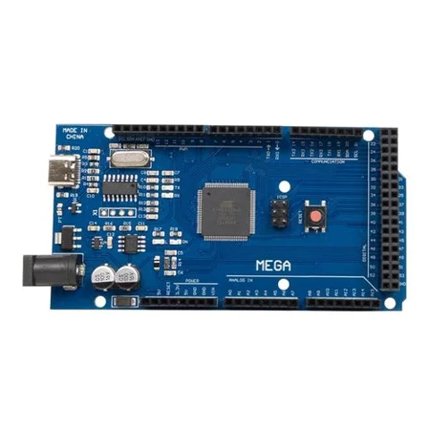

# Inland MEGA2560 R3 CH340 / SKU 837476

**Inland** · ATmega2560

Revision: Not identified

Coverage: Supporting documentation; physical pinout still needed

[Browse all manufacturers](../../../../BROWSE.md) · [Devices & IoT](../../../../DEVICES.md) · [Open in the browser guide](https://valleytech-black-wire-guide.pages.dev/?board=inland-sku-837476)

## Datasheets and original documentation

Board datasheet: **not yet recorded**. Visual reference: **available**.

[Original manufacturer product documentation](https://www.microcenter.com/product/693142/inland-mega-2560-r3-board-atmega-2560-with-usb-cable-compatible-with-arduino)

- **hardware-guide / board**: [Model specifications and hardware reference](https://www.microcenter.com/product/693142/inland-mega-2560-r3-board-atmega-2560-with-usb-cable-compatible-with-arduino) · online

Original source reviewed for model and visual type. Pin assignments and electrical limits have not been independently verified. Match the PCB revision before wiring. Exact-SKU GPIO sheet still needed; similar Arduino, ESP32 or CYD boards are not assumed interchangeable.

[Documentation coverage and remaining gaps](../../../../DOCUMENTATION.md)

## Specifications and hardware documentation

- [Original model specifications](https://www.microcenter.com/product/693142/inland-mega-2560-r3-board-atmega-2560-with-usb-cable-compatible-with-arduino)

## Inland MEGA 2560 R3 Board ATmega 2560 with USB Cable Compatible with Arduino — retail hardware identification

**product photograph** · Reviewed source · JPG

[Open original reference](../../../../library/media/b146eb1d9ca40f6c97d15f63dd57e40f7c7ddd2b2c639fcff1ca912f7ce04f13.jpg)

**Credit and rights:** Inland / original artwork contributors. Asset-specific redistribution and print rights are not established. Black Wire's editorial license does not relicense this artwork.. Source/manufacturer: Inland.

[Source 1](https://productimages.microcenter.com/693142_837476_01_front_comping.jpg) · [Source 2](https://www.microcenter.com/product/693142/inland-mega-2560-r3-board-atmega-2560-with-usb-cable-compatible-with-arduino)

Original source reviewed for model and visual type. Pin assignments and electrical limits have not been independently verified. Match the PCB revision before wiring. Exact-SKU GPIO sheet still needed; similar Arduino, ESP32 or CYD boards are not assumed interchangeable.

Image revision: Not identified

SHA-256: `b146eb1d9ca40f6c97d15f63dd57e40f7c7ddd2b2c639fcff1ca912f7ce04f13`

Pin assignments have not been independently electrically verified. Check board revision before wiring.
