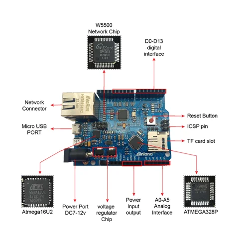

# Inland W5500 ETHERNET DEVELOPMENT BOARD (WITHOUT POE)

**Inland** · ATmega328P / W5500

Revision: Not identified

Coverage: Supporting documentation; physical pinout still needed

[Browse all manufacturers](../../../../BROWSE.md) · [Devices & IoT](../../../../DEVICES.md) · [Open in the browser guide](https://valleytech-black-wire-guide.pages.dev/?board=inland-support-671)

## Datasheets and original documentation

Board datasheet: **not yet recorded**. Visual reference: **available**.

[Original manufacturer product documentation](https://community.microcenter.com/kb/articles/671-inland-w5500-ethernet-development-board-without-poe)

- **hardware-guide / board**: [Model specifications and hardware reference](https://community.microcenter.com/kb/articles/671-inland-w5500-ethernet-development-board-without-poe) · online

Original source reviewed for model and visual type. Pin assignments and electrical limits have not been independently verified. Match the PCB revision before wiring.

[Documentation coverage and remaining gaps](../../../../DOCUMENTATION.md)

## Specifications and hardware documentation

- [Original model specifications](https://community.microcenter.com/kb/articles/671-inland-w5500-ethernet-development-board-without-poe)

## Inland W5500 ETHERNET DEVELOPMENT BOARD (WITHOUT POE) — board labeling image

**board labeling image** · Reviewed source · PNG

[Open original reference](../../../../library/media/c11a7bef8003b9d21b99ad4c7935431905fb56150fe7a713380bc2962dddfa50.png)

**Credit and rights:** Inland / original artwork contributors. Asset-specific redistribution and print rights are not established. Black Wire's editorial license does not relicense this artwork.. Source/manufacturer: Inland.

[Source 1](https://us.v-cdn.net/6031942/uploads/14T4HTZW8RY5/image.png) · [Source 2](https://community.microcenter.com/kb/articles/671-inland-w5500-ethernet-development-board-without-poe)

Original source reviewed for model and visual type. Pin assignments and electrical limits have not been independently verified. Match the PCB revision before wiring.

Image revision: Not identified

SHA-256: `c11a7bef8003b9d21b99ad4c7935431905fb56150fe7a713380bc2962dddfa50`

Pin assignments have not been independently electrically verified. Check board revision before wiring.
