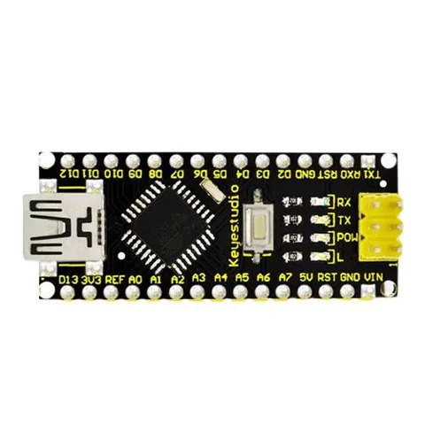

# Inland Nano 3.0 Controller Board Compatible with Arduino Nano CH340 USB Driver with Cable

**Inland** · ATmega328P

Revision: Not identified

Coverage: Supporting documentation; physical pinout still needed

[Browse all manufacturers](../../../../BROWSE.md) · [Devices & IoT](../../../../DEVICES.md) · [Open in the browser guide](https://valleytech-black-wire-guide.pages.dev/?board=inland-sku-837518)

## Datasheets and original documentation

Board datasheet: **not yet recorded**. Visual reference: **available**.

[Original manufacturer product documentation](https://www.microcenter.com/product/693143/inland-nano-30-controller-board-compatible-with-arduino-nano-ch340-usb-driver-with-cable)

- **hardware-guide / board**: [Model specifications and hardware reference](https://www.microcenter.com/product/693143/inland-nano-30-controller-board-compatible-with-arduino-nano-ch340-usb-driver-with-cable) · online

Original source reviewed for model and visual type. Pin assignments and electrical limits have not been independently verified. Match the PCB revision before wiring. Exact-SKU GPIO sheet still needed; similar Arduino, ESP32 or CYD boards are not assumed interchangeable.

[Documentation coverage and remaining gaps](../../../../DOCUMENTATION.md)

## Specifications and hardware documentation

- [Original model specifications](https://www.microcenter.com/product/693143/inland-nano-30-controller-board-compatible-with-arduino-nano-ch340-usb-driver-with-cable)

## Inland Nano 3.0 Controller Board Compatible with Arduino Nano CH340 USB Driver with Cable — retail hardware identification

**board labeling image** · Reviewed source · JPG

[Open original reference](../../../../library/media/f2635cf728ad1f23d1bb2870d173896fc24eb694c67bab7cb80b0eabcc527eb7.jpg)

**Credit and rights:** Inland / original artwork contributors. Asset-specific redistribution and print rights are not established. Black Wire's editorial license does not relicense this artwork.. Source/manufacturer: Inland.

[Source 1](https://productimages.microcenter.com/693143_837518_01_front_comping.jpg) · [Source 2](https://www.microcenter.com/product/693143/inland-nano-30-controller-board-compatible-with-arduino-nano-ch340-usb-driver-with-cable)

Original source reviewed for model and visual type. Pin assignments and electrical limits have not been independently verified. Match the PCB revision before wiring. Exact-SKU GPIO sheet still needed; similar Arduino, ESP32 or CYD boards are not assumed interchangeable.

Image revision: Not identified

SHA-256: `f2635cf728ad1f23d1bb2870d173896fc24eb694c67bab7cb80b0eabcc527eb7`

Pin assignments have not been independently electrically verified. Check board revision before wiring.
