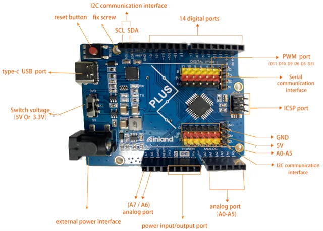

# Inland UNO PLUS Development Board

**Inland** · ATmega328P

Revision: Not identified

Coverage: Supporting documentation; physical pinout still needed

[Browse all manufacturers](../../../../BROWSE.md) · [Devices & IoT](../../../../DEVICES.md) · [Open in the browser guide](https://valleytech-black-wire-guide.pages.dev/?board=inland-support-657)

## Datasheets and original documentation

Board datasheet: **not yet recorded**. Visual reference: **available**.

[Original manufacturer product documentation](https://community.microcenter.com/kb/articles/657-inland-uno-plus-development-board)

- **hardware-guide / board**: [Model specifications and hardware reference](https://community.microcenter.com/kb/articles/657-inland-uno-plus-development-board) · online
- **product-page / board**: [Inland retail SKU 221721](https://www.microcenter.com/product/632705/inland-plus-development-board-w-type-c-interface) · online

Original source reviewed for model and visual type. Pin assignments and electrical limits have not been independently verified. Match the PCB revision before wiring.

[Documentation coverage and remaining gaps](../../../../DOCUMENTATION.md)

## Specifications and hardware documentation

- [Original model specifications](https://community.microcenter.com/kb/articles/657-inland-uno-plus-development-board)

## Inland UNO PLUS Development Board — board labeling image

**board labeling image** · Reviewed source · PNG

[Open original reference](../../../../library/media/24944016d46621f8e5bb777bcf9d9f579b6a7833aed1be958a481f43f4592a94.png)

**Credit and rights:** Inland / original artwork contributors. Asset-specific redistribution and print rights are not established. Black Wire's editorial license does not relicense this artwork.. Source/manufacturer: Inland.

[Source 1](https://us.v-cdn.net/6031942/uploads/24N56KQZNRG2/image.png) · [Source 2](https://community.microcenter.com/kb/articles/657-inland-uno-plus-development-board)

Original source reviewed for model and visual type. Pin assignments and electrical limits have not been independently verified. Match the PCB revision before wiring.

Image revision: Not identified

SHA-256: `24944016d46621f8e5bb777bcf9d9f579b6a7833aed1be958a481f43f4592a94`

Pin assignments have not been independently electrically verified. Check board revision before wiring.
