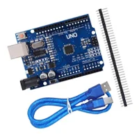

# Inland UNO R3 Development Board with CH340 Drives ATmega328P Microcontroller Module

**Inland** · ATmega328P

Revision: Not identified

Coverage: Supporting documentation; physical pinout still needed

[Browse all manufacturers](../../../../BROWSE.md) · [Devices & IoT](../../../../DEVICES.md) · [Open in the browser guide](https://valleytech-black-wire-guide.pages.dev/?board=inland-sku-837443)

## Datasheets and original documentation

Board datasheet: **not yet recorded**. Visual reference: **available**.

[Original manufacturer product documentation](https://www.microcenter.com/product/693141/inland-uno-r3-development-board-with-ch340-drives-atmega328p-microcontroller-module)

- **hardware-guide / board**: [Model specifications and hardware reference](https://www.microcenter.com/product/693141/inland-uno-r3-development-board-with-ch340-drives-atmega328p-microcontroller-module) · online

Original source reviewed for model and visual type. Pin assignments and electrical limits have not been independently verified. Match the PCB revision before wiring. Exact-SKU GPIO sheet still needed; similar Arduino, ESP32 or CYD boards are not assumed interchangeable.

[Documentation coverage and remaining gaps](../../../../DOCUMENTATION.md)

## Specifications and hardware documentation

- [Original model specifications](https://www.microcenter.com/product/693141/inland-uno-r3-development-board-with-ch340-drives-atmega328p-microcontroller-module)

## Inland UNO R3 Development Board with CH340 Drives ATmega328P Microcontroller Module — retail hardware identification

**product photograph** · Reviewed source · JPG

[Open original reference](../../../../library/media/79a182bbc29fde39099165e25b5a829891425b7f2a28ce6985b01af0dad9d679.jpg)

**Credit and rights:** Inland / original artwork contributors. Asset-specific redistribution and print rights are not established. Black Wire's editorial license does not relicense this artwork.. Source/manufacturer: Inland.

[Source 1](https://productimages.microcenter.com/0693141_837443.jpg) · [Source 2](https://www.microcenter.com/product/693141/inland-uno-r3-development-board-with-ch340-drives-atmega328p-microcontroller-module)

Original source reviewed for model and visual type. Pin assignments and electrical limits have not been independently verified. Match the PCB revision before wiring. Exact-SKU GPIO sheet still needed; similar Arduino, ESP32 or CYD boards are not assumed interchangeable.

Image revision: Not identified

SHA-256: `79a182bbc29fde39099165e25b5a829891425b7f2a28ce6985b01af0dad9d679`

Pin assignments have not been independently electrically verified. Check board revision before wiring.
