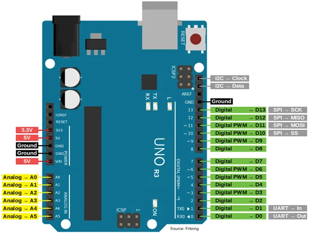

# Inland UNO R3 Main Control Board

**Inland** · ATmega328P

Revision: Not identified

Coverage: Physical pinout reference; independent completeness review pending

[Browse all manufacturers](../../../../BROWSE.md) · [Devices & IoT](../../../../DEVICES.md) · [Open in the browser guide](https://valleytech-black-wire-guide.pages.dev/?board=inland-support-644)

## Datasheets and original documentation

Board datasheet: **not yet recorded**. Visual reference: **available**.

[Original manufacturer product documentation](https://community.microcenter.com/kb/articles/644-inland-uno-r3-main-control-board)

- **hardware-guide / board**: [Model specifications and hardware reference](https://community.microcenter.com/kb/articles/644-inland-uno-r3-main-control-board) · online
- **product-page / board**: [Inland retail SKU 422212](https://www.microcenter.com/product/486544/inland-uno-r3-mainboard-arduino-compatible) · online

Original source reviewed for model and visual type. Pin assignments and electrical limits have not been independently verified. Match the PCB revision before wiring.

[Documentation coverage and remaining gaps](../../../../DOCUMENTATION.md)

## Specifications and hardware documentation

- [Original model specifications](https://community.microcenter.com/kb/articles/644-inland-uno-r3-main-control-board)

## Inland UNO R3 Main Control Board — pinout image

**pinout image** · Reviewed source · PNG

[Open original reference](../../../../library/media/c630ac9fb532db9d1ccdc423a13aed929ca95515fe5df9ad483e0c2f4c0dcbe9.png)

**Credit and rights:** Inland / original artwork contributors. Asset-specific redistribution and print rights are not established. Black Wire's editorial license does not relicense this artwork.. Source/manufacturer: Inland.

[Source 1](https://us.v-cdn.net/6031942/uploads/5AH8DO6GU0KO/image.png) · [Source 2](https://community.microcenter.com/kb/articles/644-inland-uno-r3-main-control-board)

Original source reviewed for model and visual type. Pin assignments and electrical limits have not been independently verified. Match the PCB revision before wiring.

Image revision: Not identified

SHA-256: `c630ac9fb532db9d1ccdc423a13aed929ca95515fe5df9ad483e0c2f4c0dcbe9`

Pin assignments have not been independently electrically verified. Check board revision before wiring.
