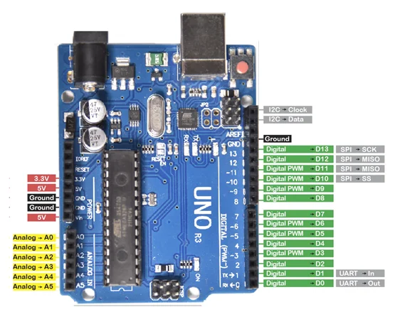

# Inland UNO / V4.0 kit board

**Inland** · ATmega328P

Revision: Not identified

Coverage: Physical pinout reference; independent completeness review pending

[Browse all manufacturers](../../../../BROWSE.md) · [Devices & IoT](../../../../DEVICES.md) · [Open in the browser guide](https://valleytech-black-wire-guide.pages.dev/?board=inland-uno-v4-kit)

## Datasheets and original documentation

Board datasheet: **not yet recorded**. Visual reference: **available**.

[Original manufacturer product documentation](https://microcenter.zendesk.com/hc/en-us/articles/24427882877975-Inland-Super-Learning-Kit-for-Arduino-Community)

- **hardware-guide / board**: [Model specifications and hardware reference](https://microcenter.zendesk.com/hc/en-us/articles/24427882877975-Inland-Super-Learning-Kit-for-Arduino-Community) · online

Source heading calls this V4.0 with CP2102, but its photo and pinout show UNO R3. Revision/USB-bridge identity is unresolved; do not apply it to the separate UNO Plus or CH340 SKU.

[Documentation coverage and remaining gaps](../../../../DOCUMENTATION.md)

## Specifications and hardware documentation

- [Original model specifications](https://microcenter.zendesk.com/hc/en-us/articles/24427882877975-Inland-Super-Learning-Kit-for-Arduino-Community)

## Archived kit UNO header map

**pinout image** · Reviewed source · PNG

[Open original reference](../../../../library/media/a608e031c04fd8d4c4d7c8a512c114902c4009e9e8fe58128f542979812a4144.png)

**Credit and rights:** Inland / original artwork contributors. Asset-specific redistribution and print rights are not established. Black Wire's editorial license does not relicense this artwork.. Source/manufacturer: Inland.

[Source 1](https://us.v-cdn.net/6031942/uploads/CG38KZGOGWVT/image.png) · [Source 2](https://microcenter.zendesk.com/hc/en-us/articles/24427882877975-Inland-Super-Learning-Kit-for-Arduino-Community)

Source heading calls this V4.0 with CP2102, but its photo and pinout show UNO R3. Revision/USB-bridge identity is unresolved; do not apply it to the separate UNO Plus or CH340 SKU.

Image revision: Not identified

SHA-256: `a608e031c04fd8d4c4d7c8a512c114902c4009e9e8fe58128f542979812a4144`

Pin assignments have not been independently electrically verified. Check board revision before wiring.
