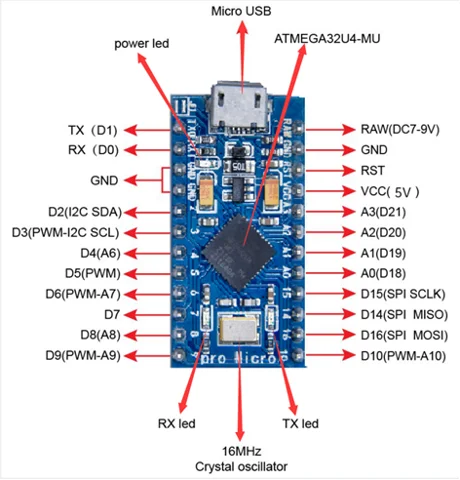

# PRO MICRO 5V 16MHZ Development Board

**Inland** · ATmega32U4

Revision: Not identified

Coverage: Physical pinout reference; independent completeness review pending

[Browse all manufacturers](../../../../BROWSE.md) · [Devices & IoT](../../../../DEVICES.md) · [Open in the browser guide](https://valleytech-black-wire-guide.pages.dev/?board=inland-support-653)

## Datasheets and original documentation

Board datasheet: **not yet recorded**. Visual reference: **available**.

[Original manufacturer product documentation](https://community.microcenter.com/kb/articles/653-pro-micro-5v-16mhz-development-board)

- **hardware-guide / board**: [Model specifications and hardware reference](https://community.microcenter.com/kb/articles/653-pro-micro-5v-16mhz-development-board) · online
- **product-page / board**: [Inland retail SKU 027441](https://www.microcenter.com/product/613815/inland-pro-micro-development-board-arduino-compatible) · online

Original source reviewed for model and visual type. Pin assignments and electrical limits have not been independently verified. Match the PCB revision before wiring.

[Documentation coverage and remaining gaps](../../../../DOCUMENTATION.md)

## Specifications and hardware documentation

- [Original model specifications](https://community.microcenter.com/kb/articles/653-pro-micro-5v-16mhz-development-board)

## PRO MICRO 5V 16MHZ Development Board — pinout image

**pinout image** · Reviewed source · PNG

[Open original reference](../../../../library/media/2f634f948010d6a187d3903e570bbde3e145dd510c44f589f20ca1a5682d78dd.png)

**Credit and rights:** Inland / original artwork contributors. Asset-specific redistribution and print rights are not established. Black Wire's editorial license does not relicense this artwork.. Source/manufacturer: Inland.

[Source 1](https://us.v-cdn.net/6031942/uploads/ZLGJE9QSLMZ3/image.png) · [Source 2](https://community.microcenter.com/kb/articles/653-pro-micro-5v-16mhz-development-board)

Original source reviewed for model and visual type. Pin assignments and electrical limits have not been independently verified. Match the PCB revision before wiring.

Image revision: Not identified

SHA-256: `2f634f948010d6a187d3903e570bbde3e145dd510c44f589f20ca1a5682d78dd`

Pin assignments have not been independently electrically verified. Check board revision before wiring.
