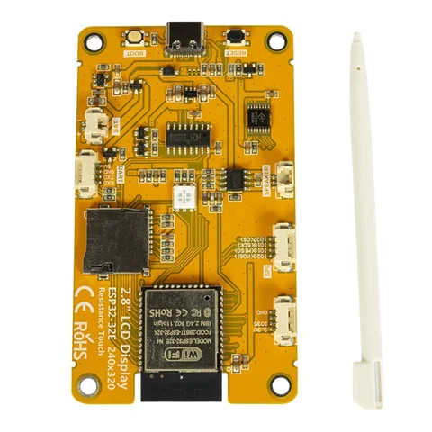

# Inland ESP32-32E 2.8-inch display / SKU 954578

**Inland** · ESP32

Revision: Not identified

Coverage: Supporting documentation; physical pinout still needed

[Browse all manufacturers](../../../../BROWSE.md) · [Devices & IoT](../../../../DEVICES.md) · [Open in the browser guide](https://valleytech-black-wire-guide.pages.dev/?board=inland-sku-954578)

Device category: **Displays & HMI**

Original source reviewed for model and visual type. Pin assignments and electrical limits have not been independently verified. Match the PCB revision before wiring. Exact-SKU GPIO sheet still needed; similar Arduino, ESP32 or CYD boards are not assumed interchangeable.

## Datasheets and original documentation

Board datasheet: **not yet recorded**. Visual reference: **available**.

[Original manufacturer product documentation](https://www.microcenter.com/product/703950/inland-28-inch-esp32-32e-display-module-resistive-touch-tft-screen)

- **hardware-guide / board**: [Model specifications and hardware reference](https://www.microcenter.com/product/703950/inland-28-inch-esp32-32e-display-module-resistive-touch-tft-screen) · online

Original source reviewed for model and visual type. Pin assignments and electrical limits have not been independently verified. Match the PCB revision before wiring. Exact-SKU GPIO sheet still needed; similar Arduino, ESP32 or CYD boards are not assumed interchangeable.

[Documentation coverage and remaining gaps](../../../../DOCUMENTATION.md)

## Specifications and hardware documentation

- [Original model specifications](https://www.microcenter.com/product/703950/inland-28-inch-esp32-32e-display-module-resistive-touch-tft-screen)

## Inland 2.8 Inch ESP32-32E Display Module Resistive Touch TFT Screen — retail hardware identification

**product photograph** · Reviewed source · JPG

[Open original reference](../../../../library/media/8d9ed059bca5305d09aa0c2f6aae42d6143cacb99aaf037d34483e9a92d8eb3a.jpg)

**Credit and rights:** Inland / original artwork contributors. Asset-specific redistribution and print rights are not established. Black Wire's editorial license does not relicense this artwork.. Source/manufacturer: Inland.

[Source 1](https://productimages.microcenter.com/703950_954578_03_front_zoom.jpg) · [Source 2](https://www.microcenter.com/product/703950/inland-28-inch-esp32-32e-display-module-resistive-touch-tft-screen)

Original source reviewed for model and visual type. Pin assignments and electrical limits have not been independently verified. Match the PCB revision before wiring. Exact-SKU GPIO sheet still needed; similar Arduino, ESP32 or CYD boards are not assumed interchangeable.

Image revision: Not identified

SHA-256: `8d9ed059bca5305d09aa0c2f6aae42d6143cacb99aaf037d34483e9a92d8eb3a`

Pin assignments have not been independently electrically verified. Check board revision before wiring.
