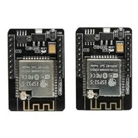

# Inland ESP32-CAM WiFi Bluetooth Camera Modules - Pair

**Inland** · ESP32

Revision: Not identified

Coverage: Supporting documentation; physical pinout still needed

[Browse all manufacturers](../../../../BROWSE.md) · [Devices & IoT](../../../../DEVICES.md) · [Open in the browser guide](https://valleytech-black-wire-guide.pages.dev/?board=inland-sku-221739)

Device category: **Cameras & audio**

Original source reviewed for model and visual type. Pin assignments and electrical limits have not been independently verified. Match the PCB revision before wiring. Exact-SKU GPIO sheet still needed; similar Arduino, ESP32 or CYD boards are not assumed interchangeable. The vendor-linked ESP32-CAM support article 672 currently returns Article not found.

## Datasheets and original documentation

Board datasheet: **not yet recorded**. Visual reference: **available**.

[Original manufacturer product documentation](https://www.microcenter.com/product/632692/inland-esp32-cam-wifi-bluetooth-camera-modules-pair)

- **hardware-guide / board**: [Model specifications and hardware reference](https://www.microcenter.com/product/632692/inland-esp32-cam-wifi-bluetooth-camera-modules-pair) · online

Original source reviewed for model and visual type. Pin assignments and electrical limits have not been independently verified. Match the PCB revision before wiring. Exact-SKU GPIO sheet still needed; similar Arduino, ESP32 or CYD boards are not assumed interchangeable. The vendor-linked ESP32-CAM support article 672 currently returns Article not found.

[Documentation coverage and remaining gaps](../../../../DOCUMENTATION.md)

## Specifications and hardware documentation

- [Original model specifications](https://www.microcenter.com/product/632692/inland-esp32-cam-wifi-bluetooth-camera-modules-pair)

## Inland ESP32-CAM WiFi Bluetooth Camera Modules - Pair — retail hardware identification

**product photograph** · Reviewed source · JPG

[Open original reference](../../../../library/media/40367a14fd0c3c4ab7215daf4ecd9cab68fe81683ef64f3c8f1bb0cd085a4636.jpg)

**Credit and rights:** Inland / original artwork contributors. Asset-specific redistribution and print rights are not established. Black Wire's editorial license does not relicense this artwork.. Source/manufacturer: Inland.

[Source 1](https://productimages.microcenter.com/0632692_221739.jpg) · [Source 2](https://www.microcenter.com/product/632692/inland-esp32-cam-wifi-bluetooth-camera-modules-pair)

Original source reviewed for model and visual type. Pin assignments and electrical limits have not been independently verified. Match the PCB revision before wiring. Exact-SKU GPIO sheet still needed; similar Arduino, ESP32 or CYD boards are not assumed interchangeable. The vendor-linked ESP32-CAM support article 672 currently returns Article not found.

Image revision: Not identified

SHA-256: `40367a14fd0c3c4ab7215daf4ecd9cab68fe81683ef64f3c8f1bb0cd085a4636`

Pin assignments have not been independently electrically verified. Check board revision before wiring.
