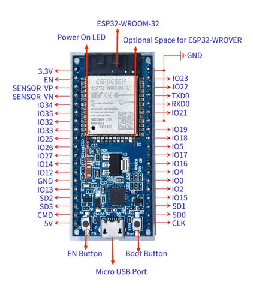
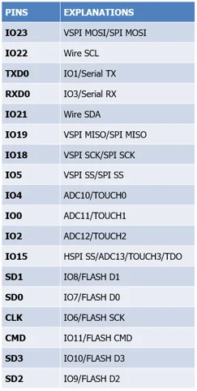
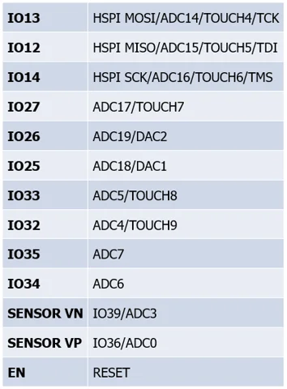

# Inland ESP32 Core Board (Black and Eco-friendly)

**Inland** · ESP32

Revision: Not identified

Coverage: Physical pinout reference; independent completeness review pending

[Browse all manufacturers](../../../../BROWSE.md) · [Devices & IoT](../../../../DEVICES.md) · [Open in the browser guide](https://valleytech-black-wire-guide.pages.dev/?board=inland-support-652)

## Datasheets and original documentation

Board datasheet: **not yet recorded**. Visual reference: **available**.

[Original manufacturer product documentation](https://community.microcenter.com/kb/articles/652-inland-esp32-core-board-black-and-eco-friendly)

- **hardware-guide / board**: [Model specifications and hardware reference](https://community.microcenter.com/kb/articles/652-inland-esp32-core-board-black-and-eco-friendly) · online
- **product-page / board**: [Inland retail SKU 027466](https://www.microcenter.com/product/613822/inland-esp32-wroom-32d-module) · online

Original source reviewed for model and visual type. Pin assignments and electrical limits have not been independently verified. Match the PCB revision before wiring.

[Documentation coverage and remaining gaps](../../../../DOCUMENTATION.md)

## Specifications and hardware documentation

- [Original model specifications](https://community.microcenter.com/kb/articles/652-inland-esp32-core-board-black-and-eco-friendly)

## Inland ESP32 Core Board (Black and Eco-friendly) — pinout image

**pinout image** · Reviewed source · PNG

[Open original reference](../../../../library/media/9eea76c450424102406b5d7ed606467b14f4aaf0a51c2e72ddebf2c71f20e701.png)

**Credit and rights:** Inland / original artwork contributors. Asset-specific redistribution and print rights are not established. Black Wire's editorial license does not relicense this artwork.. Source/manufacturer: Inland.

[Source 1](https://us.v-cdn.net/6031942/uploads/SF436SK1ZJEC/image.png) · [Source 2](https://community.microcenter.com/kb/articles/652-inland-esp32-core-board-black-and-eco-friendly)

Original source reviewed for model and visual type. Pin assignments and electrical limits have not been independently verified. Match the PCB revision before wiring.

Image revision: Not identified

SHA-256: `9eea76c450424102406b5d7ed606467b14f4aaf0a51c2e72ddebf2c71f20e701`

## Inland ESP32 Core Board (Black and Eco-friendly) — pin function reference

**pin function reference** · Reviewed source · PNG

[Open original reference](../../../../library/media/49683796714e267f388f291cae7024531e1a480b7c3b4412c46720a6b36e8197.png)

**Credit and rights:** Inland / original artwork contributors. Asset-specific redistribution and print rights are not established. Black Wire's editorial license does not relicense this artwork.. Source/manufacturer: Inland.

[Source 1](https://us.v-cdn.net/6031942/uploads/NROJO6ZQCF1K/image.png) · [Source 2](https://community.microcenter.com/kb/articles/652-inland-esp32-core-board-black-and-eco-friendly)

Original source reviewed for model and visual type. Pin assignments and electrical limits have not been independently verified. Match the PCB revision before wiring.

Image revision: Not identified

SHA-256: `49683796714e267f388f291cae7024531e1a480b7c3b4412c46720a6b36e8197`

## Inland ESP32 Core Board (Black and Eco-friendly) — pin function reference

**pin function reference** · Reviewed source · PNG

[Open original reference](../../../../library/media/16b1697ab84a45f9fe02a15e9db1e62f6f9795286ee882c20cfa9cfb6fa563a9.png)

**Credit and rights:** Inland / original artwork contributors. Asset-specific redistribution and print rights are not established. Black Wire's editorial license does not relicense this artwork.. Source/manufacturer: Inland.

[Source 1](https://us.v-cdn.net/6031942/uploads/QBHYWJS55LYB/image.png) · [Source 2](https://community.microcenter.com/kb/articles/652-inland-esp32-core-board-black-and-eco-friendly)

Original source reviewed for model and visual type. Pin assignments and electrical limits have not been independently verified. Match the PCB revision before wiring.

Image revision: Not identified

SHA-256: `16b1697ab84a45f9fe02a15e9db1e62f6f9795286ee882c20cfa9cfb6fa563a9`

Pin assignments have not been independently electrically verified. Check board revision before wiring.
