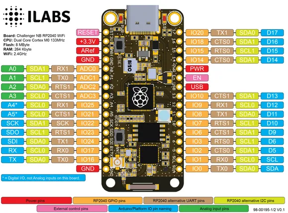

# Challenger NB RP2040 WiFi

**Invector Labs** · RP2040

Revision: Not identified  
Coverage: Pinout image collected

[Browse all manufacturers](../../../../BROWSE.md) · [Desktop app](https://github.com/valleytechsolutions/black-wire-desktop)

## Physical board pinout

**pinout image** · Reviewed source · PNG

[Open original reference](../../../../library/media/b90f4ab2ba9e9b4b1ebdd3b70a6b89d75d01eda052e0b4eba13810e607d3157a.png)

**Credit and rights:** Not established; source attribution retained. Source/manufacturer: Invector Labs.

[Source 1](https://ilabs.se/wp-content/uploads/2021/08/challenger-nb-rp2040-wifi-pinout-diagram-v0.1-1024x759.png) · [Source 2](https://www.tindie.com/products/invector/challenger-nb-rp2040-wifi/)

Discovered from CircuitPython board metadata and the linked product/documentation page. Exact hardware revision requires matching to the diagram.

SHA-256: `b90f4ab2ba9e9b4b1ebdd3b70a6b89d75d01eda052e0b4eba13810e607d3157a`

Pin assignments have not been independently electrically verified. Check board revision before wiring.
