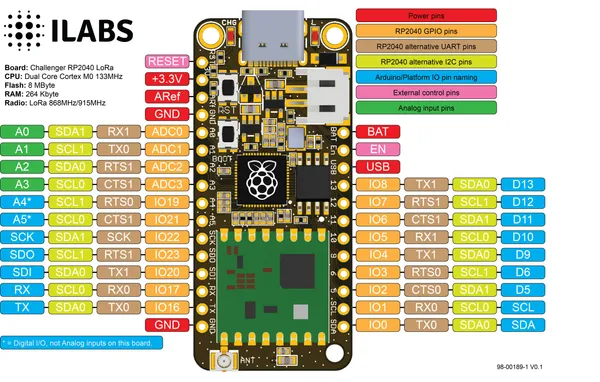
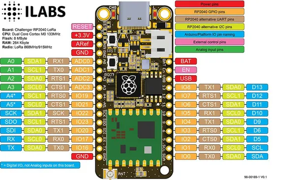

# Challenger RP2040 LoRa

**Invector Labs** · RP2040

Revision: Not identified  
Coverage: Pinout image collected

[Browse all manufacturers](../../../../BROWSE.md) · [Desktop app](https://github.com/valleytechsolutions/black-wire-desktop)

## Physical board pinout

**pinout image** · Reviewed source · PNG

[Open original reference](../../../../library/media/d1578e7a265942da0793684fd4b563f670a456aa50a811bc238f2288d72c3f1d.png)

**Credit and rights:** Not established; source attribution retained. Source/manufacturer: Invector Labs.

[Source 1](https://ilabs.se/wp-content/uploads/2022/02/challenger-rp2040-lora-pinout-diagram-v0.1.png) · [Source 2](https://www.tindie.com/products/invector/challenger-rp2040-lora-915mhz/)

Discovered from CircuitPython board metadata and the linked product/documentation page. Exact hardware revision requires matching to the diagram.

SHA-256: `d1578e7a265942da0793684fd4b563f670a456aa50a811bc238f2288d72c3f1d`

## Physical board pinout

**pinout image** · Reviewed source · JPG

[Open original reference](../../../../library/media/4de34d6839755f153fd1b2ce2499bee450e008a724f01f4b8f638c0373d79070.jpg)

**Credit and rights:** Not established; source attribution retained. Source/manufacturer: Invector Labs.

[Source 1](https://cdn.shopify.com/s/files/1/0176/3274/files/challenger-rp2040-lora-pinout-diagram_1.jpg?v=1649251857) · [Source 2](https://thepihut.com/products/challenger-rp2040-lora-868mhz)

Discovered from CircuitPython board metadata and the linked product/documentation page. Exact hardware revision requires matching to the diagram.

SHA-256: `4de34d6839755f153fd1b2ce2499bee450e008a724f01f4b8f638c0373d79070`

Pin assignments have not been independently electrically verified. Check board revision before wiring.
