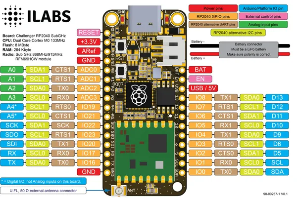

# Challenger RP2040 SubGHz

**Invector Labs** · RP2040

Revision: Not identified

Coverage: Pinout image collected

[Browse all manufacturers](../../../../BROWSE.md) · [Devices & IoT](../../../../DEVICES.md) · [Open in the browser guide](https://valleytech-black-wire-guide.pages.dev/?board=invector-labs-rp2040-challenger-rp2040-subghz)

## Datasheets and original documentation

Board datasheet: **not yet recorded**. Visual reference: **available**.

Original manufacturer website still needs identification.

A chip datasheet, schematic and board datasheet have different scopes. Match the exact hardware revision.

[Documentation coverage and remaining gaps](../../../../DOCUMENTATION.md)

## Physical board pinout

**pinout image** · Reviewed source · PNG

[Open original reference](../../../../library/media/fcf966924b4a9361470ca46057a634ca055bd90c21bbd2489778e98f18e2ee58.png)

**Credit and rights:** Not established; source attribution retained. Source/manufacturer: Invector Labs.

[Source 1](https://i0.wp.com/ilabs.se/wp-content/uploads/2022/06/challenger-rp2040-subghz-pinout-diagram-v0.1.png) · [Source 2](https://ilabs.se/product/challenger-rp2040-subghz-915mhz/)

Discovered from CircuitPython board metadata and the linked product/documentation page. Exact hardware revision requires matching to the diagram.

Image revision: Not identified

SHA-256: `fcf966924b4a9361470ca46057a634ca055bd90c21bbd2489778e98f18e2ee58`

Pin assignments have not been independently electrically verified. Check board revision before wiring.
