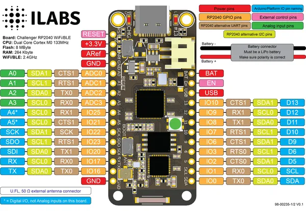

# Challenger RP2040 WiFi/BLE

**Invector Labs** · RP2040

Revision: Not identified  
Coverage: Pinout image collected

[Browse all manufacturers](../../../../BROWSE.md) · [Desktop app](https://github.com/valleytechsolutions/black-wire-desktop)

## Physical board pinout

**pinout image** · Reviewed source · PNG

[Open original reference](../../../../library/media/49360406c7741c46cfed92e270653c2af887edd0489dbc4a86808fbc715da8c0.png)

**Credit and rights:** Not established; source attribution retained. Source/manufacturer: Invector Labs.

[Source 1](https://i0.wp.com/ilabs.se/wp-content/uploads/2022/06/challenger-rp2040-wifi-ble-pinout-diagram-v0.1.png) · [Source 2](https://ilabs.se/product/challenger-rp2040-wifi-ble-with-chip-antenna/)

Discovered from CircuitPython board metadata and the linked product/documentation page. Exact hardware revision requires matching to the diagram.

SHA-256: `49360406c7741c46cfed92e270653c2af887edd0489dbc4a86808fbc715da8c0`

Pin assignments have not been independently electrically verified. Check board revision before wiring.
