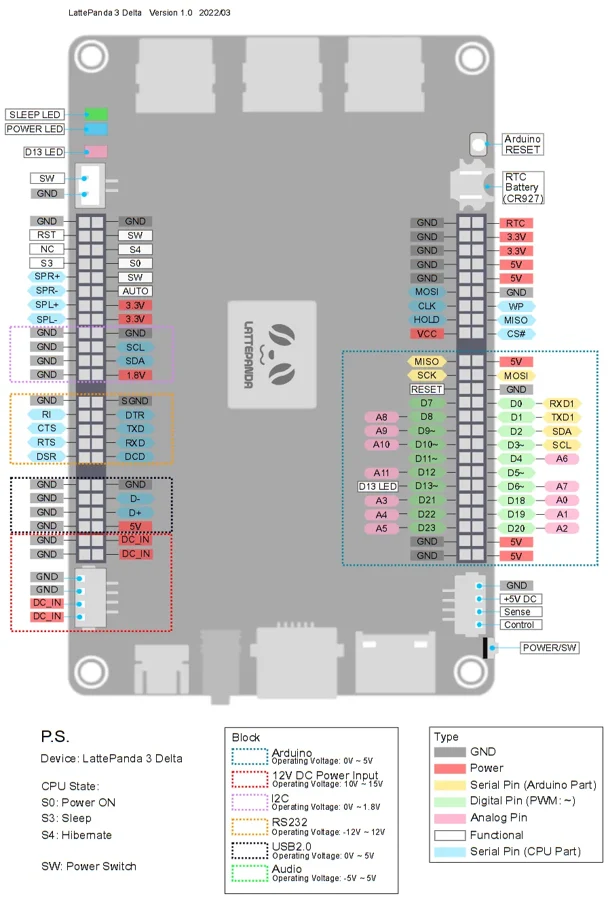
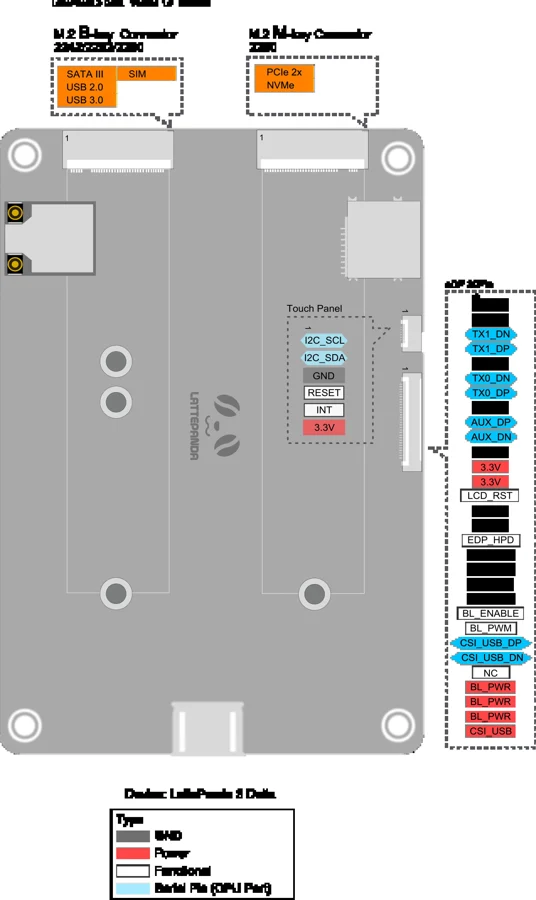

# 3 Delta

**LattePanda** · Other SBC

Revision: See original diagram

Coverage: Physical pinout source collected; scope and revision require confirmation

[Browse all manufacturers](../../../../BROWSE.md) · [Devices & IoT](../../../../DEVICES.md) · [Open in the browser guide](https://valleytech-black-wire-guide.pages.dev/?board=lattepanda-3-delta)

Architecture: **x86**

## Specifications and hardware documentation

- [Specifications & hardware guide](https://docs.lattepanda.com/content/3rd_delta_edition/io_playability/)

## Connector pinout — front

**pinout image** · Reviewed source · WEBP

[Open original reference](../../../../library/media/8dcb063f1942b0a6a066e43f4df00a95574d6ebbdc75e70a4f092f315c71845e.webp)

**Credit and rights:** LattePanda / original diagram contributors. Rights not established for this asset; attribution retained. Original artwork is not covered by Black Wire's editorial license.. Source/manufacturer: LattePanda.

[Source 1](https://docs.lattepanda.com/assets/images/LattePanda%203%20Delta/3_delta_pinout_update.webp) · [Source 2](https://docs.lattepanda.com/content/3rd_delta_edition/io_playability/)

Original publisher reference. Exact board/revision and electrical limits still require confirmation. Only the connectors shown are mapped. On-board MCU GPIO, CPU signals, power and serial interfaces have different electrical requirements.

Image revision: See original diagram

SHA-256: `8dcb063f1942b0a6a066e43f4df00a95574d6ebbdc75e70a4f092f315c71845e`

## Connector pinout — back

**pinout image** · Reviewed source · WEBP

[Open original reference](../../../../library/media/f2711e9de62cb1ed462ced7eb664f776f4f9941a749e164a50c8892e16578c76.webp)

**Credit and rights:** LattePanda / original diagram contributors. Rights not established for this asset; attribution retained. Original artwork is not covered by Black Wire's editorial license.. Source/manufacturer: LattePanda.

[Source 1](https://docs.lattepanda.com/assets/images/LattePanda%203%20Delta/LP3DeltaBottomPinout.webp) · [Source 2](https://docs.lattepanda.com/content/3rd_delta_edition/io_playability/)

Original publisher reference. Exact board/revision and electrical limits still require confirmation. Only the connectors shown are mapped. On-board MCU GPIO, CPU signals, power and serial interfaces have different electrical requirements.

Image revision: See original diagram

SHA-256: `f2711e9de62cb1ed462ced7eb664f776f4f9941a749e164a50c8892e16578c76`

Pin assignments have not been independently electrically verified. Check board revision before wiring.
