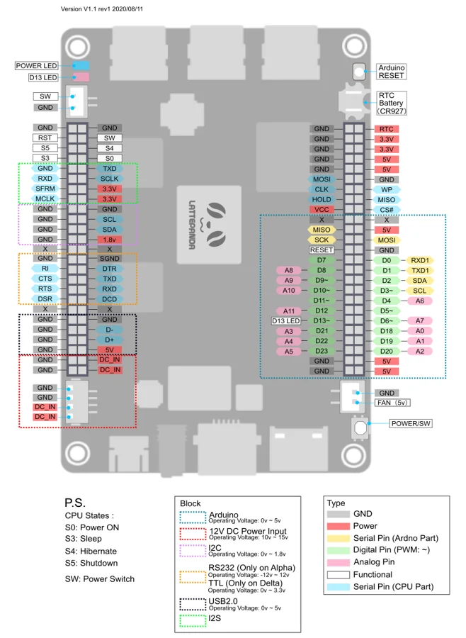
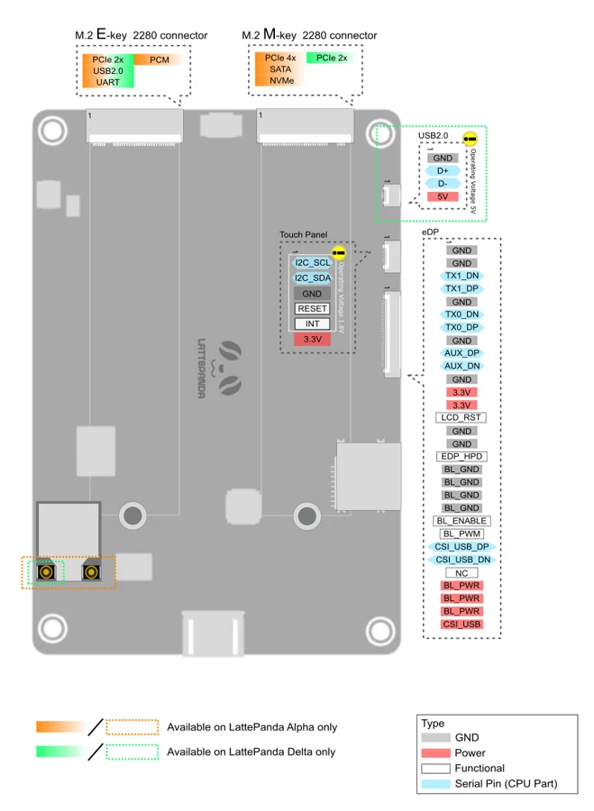

# Delta

**LattePanda** · Other SBC

Revision: See original diagram

Coverage: Physical pinout source collected; scope and revision require confirmation

[Browse all manufacturers](../../../../BROWSE.md) · [Devices & IoT](../../../../DEVICES.md) · [Open in the browser guide](https://valleytech-black-wire-guide.pages.dev/?board=lattepanda-delta)

Architecture: **x86**

## Specifications and hardware documentation

- [Specifications & hardware guide](https://docs.lattepanda.com/content/alpha_edition/io_playability/)

## Connector pinout — front

**pinout image** · Reviewed source · WEBP

[Open original reference](../../../../library/media/c34eaa1fbefbd6923171b75019c9f8df0f8975f8fc5b6d33770aee3d75acac9e.webp)

**Credit and rights:** LattePanda / original diagram contributors. Rights not established for this asset; attribution retained. Original artwork is not covered by Black Wire's editorial license.. Source/manufacturer: LattePanda.

[Source 1](https://docs.lattepanda.com/assets/images/alphadelta%20top%20pinout%2020200811.webp) · [Source 2](https://docs.lattepanda.com/content/alpha_edition/io_playability/)

Original publisher reference. Exact board/revision and electrical limits still require confirmation. Only the connectors shown are mapped. On-board MCU GPIO, CPU signals, power and serial interfaces have different electrical requirements. Publisher shares this diagram between Alpha and Delta; observe its model-specific color legend.

Image revision: See original diagram

SHA-256: `c34eaa1fbefbd6923171b75019c9f8df0f8975f8fc5b6d33770aee3d75acac9e`

## Connector pinout — back

**pinout image** · Reviewed source · WEBP

[Open original reference](../../../../library/media/38665299f86d25026a805691e2982030989ea2d629fd07d4d6119b66787ff88d.webp)

**Credit and rights:** LattePanda / original diagram contributors. Rights not established for this asset; attribution retained. Original artwork is not covered by Black Wire's editorial license.. Source/manufacturer: LattePanda.

[Source 1](https://docs.lattepanda.com/assets/images/alphadelta%20bot%20pinout%2020200811.webp) · [Source 2](https://docs.lattepanda.com/content/alpha_edition/io_playability/)

Original publisher reference. Exact board/revision and electrical limits still require confirmation. Only the connectors shown are mapped. On-board MCU GPIO, CPU signals, power and serial interfaces have different electrical requirements. Publisher shares this diagram between Alpha and Delta; observe its model-specific color legend.

Image revision: See original diagram

SHA-256: `38665299f86d25026a805691e2982030989ea2d629fd07d4d6119b66787ff88d`

Pin assignments have not been independently electrically verified. Check board revision before wiring.
