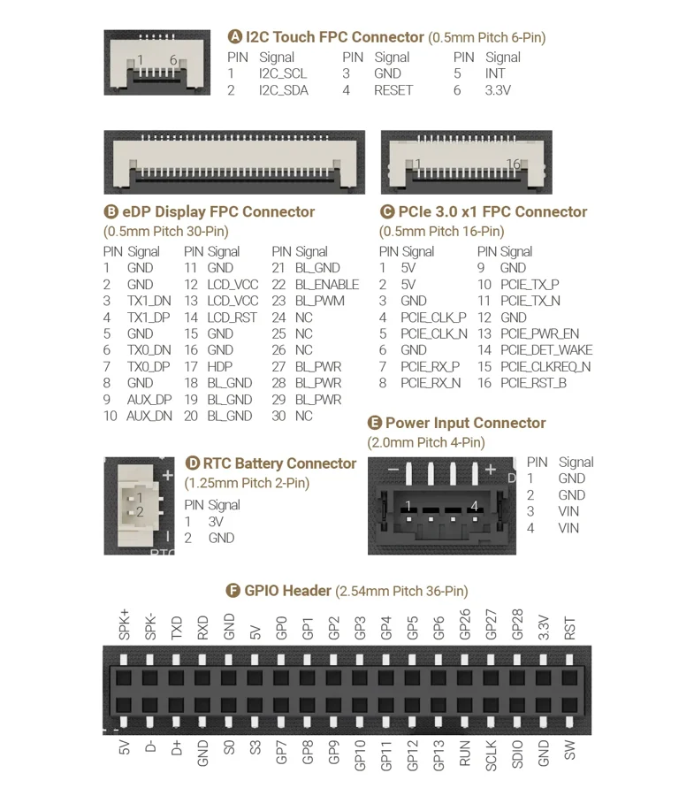
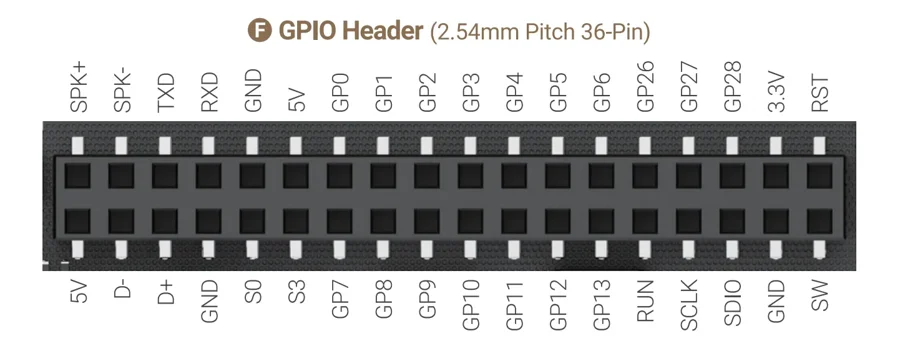

# IOTA

**LattePanda** · Other SBC

Revision: See original diagram

Coverage: Physical pinout source collected; scope and revision require confirmation

[Browse all manufacturers](../../../../BROWSE.md) · [Devices & IoT](../../../../DEVICES.md) · [Open in the browser guide](https://valleytech-black-wire-guide.pages.dev/?board=lattepanda-iota)

Architecture: **x86**

## Specifications and hardware documentation

- [Specifications & hardware guide](https://docs.lattepanda.com/content/iota_edition/io_playability_Internal/)

## Connector pinout — manufacturer reference

**pinout image** · Reviewed source · WEBP

[Open original reference](../../../../library/media/027b50ba35cd63b8d9d7b336e25b0f59234cf9b0f82a1f570cf67d028b464572.webp)

**Credit and rights:** LattePanda / original diagram contributors. Rights not established for this asset; attribution retained. Original artwork is not covered by Black Wire's editorial license.. Source/manufacturer: LattePanda.

[Source 1](https://docs.lattepanda.com/assets/images/LattePanda%20Iota/pinout.webp) · [Source 2](https://docs.lattepanda.com/content/iota_edition/io_playability/)

Original publisher reference. Exact board/revision and electrical limits still require confirmation. Only the connectors shown are mapped. On-board MCU GPIO, CPU signals, power and serial interfaces have different electrical requirements.

Image revision: See original diagram

SHA-256: `027b50ba35cd63b8d9d7b336e25b0f59234cf9b0f82a1f570cf67d028b464572`

## Connector pinout — GPIO header

**pinout image** · Reviewed source · WEBP

[Open original reference](../../../../library/media/df1addf325d4e1fcfa488aeae3961c5367ff9c064785035c68cd44587d46d63e.webp)

**Credit and rights:** LattePanda / original diagram contributors. Rights not established for this asset; attribution retained. Original artwork is not covered by Black Wire's editorial license.. Source/manufacturer: LattePanda.

[Source 1](https://docs.lattepanda.com/assets/images/LattePanda%20Iota/GPIO.webp) · [Source 2](https://docs.lattepanda.com/content/iota_edition/io_playability_Internal/) · [Source 3](https://docs.lattepanda.com/content/iota_edition/io_playability/)

Original publisher reference. Exact board/revision and electrical limits still require confirmation. Only the connectors shown are mapped. On-board MCU GPIO, CPU signals, power and serial interfaces have different electrical requirements.

Image revision: See original diagram

SHA-256: `df1addf325d4e1fcfa488aeae3961c5367ff9c064785035c68cd44587d46d63e`

Pin assignments have not been independently electrically verified. Check board revision before wiring.
