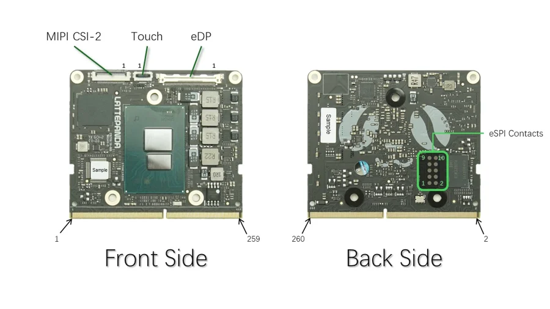

# Mu

**LattePanda** · Other SBC

Revision: Not identified

Coverage: Supporting reference collected; physical pinout still needed

[Browse all manufacturers](../../../../BROWSE.md) · [Devices & IoT](../../../../DEVICES.md) · [Open in the browser guide](https://valleytech-black-wire-guide.pages.dev/?board=lattepanda-mu)

Architecture: **x86**

## Specifications and hardware documentation

- [Specifications & hardware guide](https://docs.lattepanda.com/content/mu_edition/introduction/)

## Compute-module connector orientation

**board labeling image** · Reviewed source · JPG

[Open original reference](../../../../library/media/60c542b741cd67bc5cb90c1cb4d4420e5d298b14220b6076afe2c76eda8294d0.jpg)

**Credit and rights:** LattePanda / original diagram contributors. Rights not established for this asset; attribution retained. Original artwork is not covered by Black Wire's editorial license.. Source/manufacturer: LattePanda.

[Source 1](https://raw.githubusercontent.com/LattePandaTeam/LattePanda-Mu/de2262501378bcbc710625b733b5bf4b4b3d6e39/Electricals/Pinouts/pinout.jpg) · [Source 2](https://docs.lattepanda.com/content/mu_edition/introduction/) · [Source 3](https://github.com/LattePandaTeam/LattePanda-Mu/tree/de2262501378bcbc710625b733b5bf4b4b3d6e39) · [Source 4](https://github.com/LattePandaTeam/LattePanda-Mu/tree/de2262501378bcbc710625b733b5bf4b4b3d6e39/Electricals/Pinouts)

Original publisher reference. Exact board/revision and electrical limits still require confirmation. Connector orientation only. Per-contact signal definitions are in the manufacturer edge-connector spreadsheet. A full signal pinout image is still needed.

Image revision: Not identified

SHA-256: `60c542b741cd67bc5cb90c1cb4d4420e5d298b14220b6076afe2c76eda8294d0`

## Original 260-contact signal definitions (XLSX)

**source reference** · Original source retained; spreadsheet contents not independently reviewed · XLSX

[Open original reference](../../../../library/media/03ed31c02cbe782387a658e15d2f7e41a13e56d8d1ceb4c6ae9c23dc6dac271d.xlsx)

**Credit and rights:** LattePanda / DFRobot; artwork rights not established; source attribution retained.. Source/manufacturer: LattePanda.

[Source 1](https://raw.githubusercontent.com/LattePandaTeam/LattePanda-Mu/de2262501378bcbc710625b733b5bf4b4b3d6e39/Electricals/Pinouts/LattePanda_Mu_Edge_Connector_Pinout.xlsx) · [Source 2](https://docs.lattepanda.com/content/mu_edition/introduction/) · [Source 3](https://github.com/LattePandaTeam/LattePanda-Mu/tree/de2262501378bcbc710625b733b5bf4b4b3d6e39) · [Source 4](https://github.com/LattePandaTeam/LattePanda-Mu/tree/de2262501378bcbc710625b733b5bf4b4b3d6e39/Electricals/Pinouts)

Manufacturer spreadsheet, preserved unchanged. Download to view per-contact functions; the orientation image alone is not a GPIO signal map.

Image revision: See manufacturer spreadsheet

SHA-256: `03ed31c02cbe782387a658e15d2f7e41a13e56d8d1ceb4c6ae9c23dc6dac271d`

Pin assignments have not been independently electrically verified. Check board revision before wiring.
