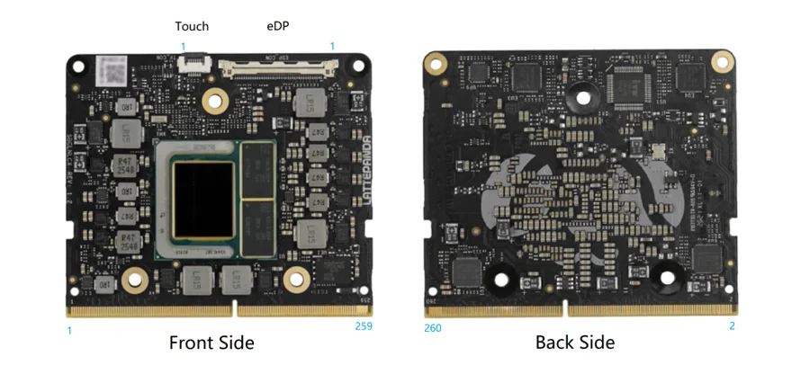

# Mu Ultra

**LattePanda** · Other SBC

Revision: Not identified

Coverage: Supporting reference collected; physical pinout still needed

[Browse all manufacturers](../../../../BROWSE.md) · [Devices & IoT](../../../../DEVICES.md) · [Open in the browser guide](https://valleytech-black-wire-guide.pages.dev/?board=lattepanda-mu-ultra)

Architecture: **x86**

## Specifications and hardware documentation

- [Specifications & hardware guide](https://docs.lattepanda.com/content/mu_ultra_edition/introduction/)

## Compute-module connector orientation

**board labeling image** · Reviewed source · PNG

[Open original reference](../../../../library/media/6180df82d4bf636663bb82fa376e19f71f228a0ae4a8b362221a57cfafb287f0.png)

**Credit and rights:** LattePanda / original diagram contributors. Rights not established for this asset; attribution retained. Original artwork is not covered by Black Wire's editorial license.. Source/manufacturer: LattePanda.

[Source 1](https://raw.githubusercontent.com/LattePandaTeam/LattePanda-Mu-Ultra/8dbe7f9f4fec959ac0394cef9a78c958e5154067/Electricals/Pinouts/pinout.png) · [Source 2](https://docs.lattepanda.com/content/mu_ultra_edition/introduction/) · [Source 3](https://github.com/LattePandaTeam/LattePanda-Mu-Ultra/tree/8dbe7f9f4fec959ac0394cef9a78c958e5154067) · [Source 4](https://github.com/LattePandaTeam/LattePanda-Mu-Ultra/tree/8dbe7f9f4fec959ac0394cef9a78c958e5154067/Electricals/Pinouts)

Original publisher reference. Exact board/revision and electrical limits still require confirmation. Connector orientation only. Per-contact signal definitions are in the manufacturer edge-connector spreadsheet. A full signal pinout image is still needed.

Image revision: Not identified

SHA-256: `6180df82d4bf636663bb82fa376e19f71f228a0ae4a8b362221a57cfafb287f0`

## Original 260-contact signal definitions (XLSX)

**source reference** · Original source retained; spreadsheet contents not independently reviewed · XLSX

[Open original reference](../../../../library/media/089f8318a9cd610e843e374b12a7e728fcfdd71af7f822f3291f724ce3fe9692.xlsx)

**Credit and rights:** LattePanda / DFRobot; artwork rights not established; source attribution retained.. Source/manufacturer: LattePanda.

[Source 1](https://raw.githubusercontent.com/LattePandaTeam/LattePanda-Mu-Ultra/8dbe7f9f4fec959ac0394cef9a78c958e5154067/Electricals/Pinouts/LattePanda_Mu_Ultra_Edge_Connector_Pinout.xlsx) · [Source 2](https://docs.lattepanda.com/content/mu_ultra_edition/introduction/) · [Source 3](https://github.com/LattePandaTeam/LattePanda-Mu-Ultra/tree/8dbe7f9f4fec959ac0394cef9a78c958e5154067) · [Source 4](https://github.com/LattePandaTeam/LattePanda-Mu-Ultra/tree/8dbe7f9f4fec959ac0394cef9a78c958e5154067/Electricals/Pinouts)

Manufacturer spreadsheet, preserved unchanged. Download to view per-contact functions; the orientation image alone is not a GPIO signal map.

Image revision: See manufacturer spreadsheet

SHA-256: `089f8318a9cd610e843e374b12a7e728fcfdd71af7f822f3291f724ce3fe9692`

Pin assignments have not been independently electrically verified. Check board revision before wiring.
