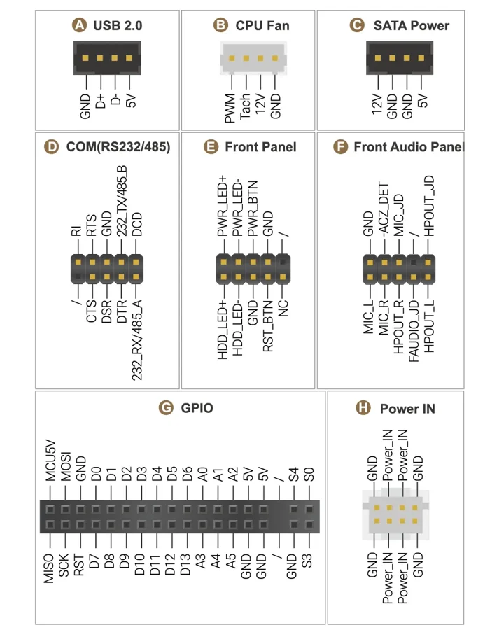
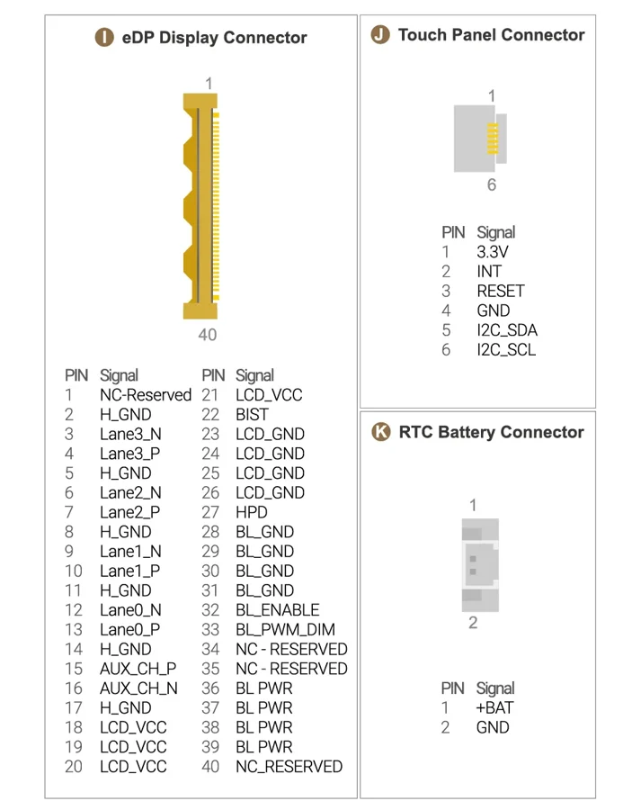
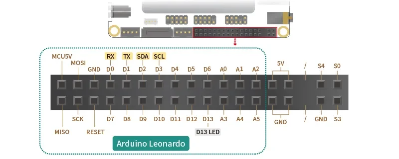
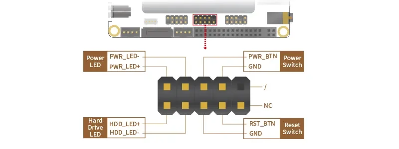
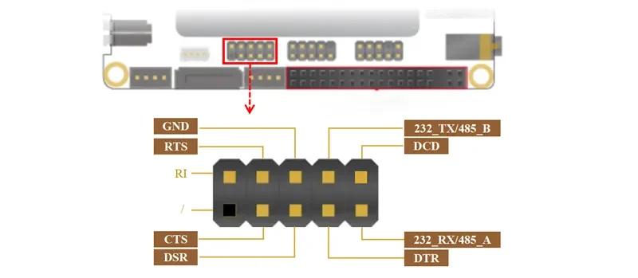

# Sigma

**LattePanda** · Other SBC

Revision: See original diagram

Coverage: Physical pinout source collected; scope and revision require confirmation

[Browse all manufacturers](../../../../BROWSE.md) · [Devices & IoT](../../../../DEVICES.md) · [Open in the browser guide](https://valleytech-black-wire-guide.pages.dev/?board=lattepanda-sigma)

Architecture: **x86**

## Specifications and hardware documentation

- [Specifications & hardware guide](https://docs.lattepanda.com/content/sigma_edition/IO_Playability_Internal/)

## Connector pinout — manufacturer reference

**pinout image** · Reviewed source · WEBP

[Open original reference](../../../../library/media/f7212666162a7fe02c8beebac48aa4235a621a7ed0c92d0f8bb5ac221ba61f57.webp)

**Credit and rights:** LattePanda / original diagram contributors. Rights not established for this asset; attribution retained. Original artwork is not covered by Black Wire's editorial license.. Source/manufacturer: LattePanda.

[Source 1](https://docs.lattepanda.com/assets/images/Sigma/LattePanda%20Sigma%20Layout%20Top%20PIN%20headers.webp) · [Source 2](https://docs.lattepanda.com/content/sigma_edition/IO_Playability/)

Original publisher reference. Exact board/revision and electrical limits still require confirmation. Only the connectors shown are mapped. On-board MCU GPIO, CPU signals, power and serial interfaces have different electrical requirements.

Image revision: See original diagram

SHA-256: `f7212666162a7fe02c8beebac48aa4235a621a7ed0c92d0f8bb5ac221ba61f57`

## Connector pinout — manufacturer reference

**pinout image** · Reviewed source · WEBP

[Open original reference](../../../../library/media/8c5289c7d62c00bd790a3a3b2583f96dbd4fe75fc8c7a93b99ce9eec0c306486.webp)

**Credit and rights:** LattePanda / original diagram contributors. Rights not established for this asset; attribution retained. Original artwork is not covered by Black Wire's editorial license.. Source/manufacturer: LattePanda.

[Source 1](https://docs.lattepanda.com/assets/images/Sigma/LattePanda%20Sigma%20Layout%20Bottom%20PIN%20headers.webp) · [Source 2](https://docs.lattepanda.com/content/sigma_edition/IO_Playability/)

Original publisher reference. Exact board/revision and electrical limits still require confirmation. Only the connectors shown are mapped. On-board MCU GPIO, CPU signals, power and serial interfaces have different electrical requirements.

Image revision: See original diagram

SHA-256: `8c5289c7d62c00bd790a3a3b2583f96dbd4fe75fc8c7a93b99ce9eec0c306486`

## Connector pinout — GPIO header

**pinout image** · Reviewed source · WEBP

[Open original reference](../../../../library/media/2aa5ff6aca97d98acf2257be99470abfc2f328f76ea269fa2ac643ad3ea5072c.webp)

**Credit and rights:** LattePanda / original diagram contributors. Rights not established for this asset; attribution retained. Original artwork is not covered by Black Wire's editorial license.. Source/manufacturer: LattePanda.

[Source 1](https://docs.lattepanda.com/assets/images/Sigma/Sigma%20Arduino%20pins.webp) · [Source 2](https://docs.lattepanda.com/content/sigma_edition/IO_Playability_Internal/) · [Source 3](https://docs.lattepanda.com/content/sigma_edition/IO_Playability/)

Original publisher reference. Exact board/revision and electrical limits still require confirmation. Only the connectors shown are mapped. On-board MCU GPIO, CPU signals, power and serial interfaces have different electrical requirements.

Image revision: See original diagram

SHA-256: `2aa5ff6aca97d98acf2257be99470abfc2f328f76ea269fa2ac643ad3ea5072c`

## Connector pinout — manufacturer reference

**pinout image** · Reviewed source · WEBP

[Open original reference](../../../../library/media/a491825978c54f72ab9e8dcd41072ab48657a634e3230786da60576616abcb90.webp)

**Credit and rights:** LattePanda / original diagram contributors. Rights not established for this asset; attribution retained. Original artwork is not covered by Black Wire's editorial license.. Source/manufacturer: LattePanda.

[Source 1](https://docs.lattepanda.com/assets/images/Sigma/Sigma%20Front%20Panel%20pins.webp) · [Source 2](https://docs.lattepanda.com/content/sigma_edition/IO_Playability_Internal/) · [Source 3](https://docs.lattepanda.com/content/sigma_edition/IO_Playability/)

Original publisher reference. Exact board/revision and electrical limits still require confirmation. Only the connectors shown are mapped. On-board MCU GPIO, CPU signals, power and serial interfaces have different electrical requirements.

Image revision: See original diagram

SHA-256: `a491825978c54f72ab9e8dcd41072ab48657a634e3230786da60576616abcb90`

## Connector pinout — manufacturer reference

**pinout image** · Reviewed source · WEBP

[Open original reference](../../../../library/media/f7167c9443753c5a2575c5e1a1b94632eebb82e79041604e6fa5d9645f0a8230.webp)

**Credit and rights:** LattePanda / original diagram contributors. Rights not established for this asset; attribution retained. Original artwork is not covered by Black Wire's editorial license.. Source/manufacturer: LattePanda.

[Source 1](https://docs.lattepanda.com/assets/images/Sigma/Sigma%20RS232_485%20pins.webp) · [Source 2](https://docs.lattepanda.com/content/sigma_edition/IO_Playability_Internal/) · [Source 3](https://docs.lattepanda.com/content/sigma_edition/IO_Playability/)

Original publisher reference. Exact board/revision and electrical limits still require confirmation. Only the connectors shown are mapped. On-board MCU GPIO, CPU signals, power and serial interfaces have different electrical requirements.

Image revision: See original diagram

SHA-256: `f7167c9443753c5a2575c5e1a1b94632eebb82e79041604e6fa5d9645f0a8230`

Pin assignments have not been independently electrically verified. Check board revision before wiring.
