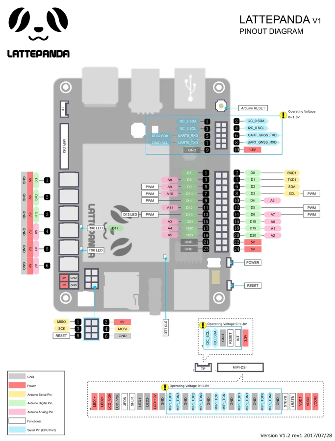

# V1

**LattePanda** · Other SBC

Revision: See original diagram

Coverage: Physical pinout source collected; scope and revision require confirmation

[Browse all manufacturers](../../../../BROWSE.md) · [Devices & IoT](../../../../DEVICES.md) · [Open in the browser guide](https://valleytech-black-wire-guide.pages.dev/?board=lattepanda-v1)

Architecture: **x86**

## Specifications and hardware documentation

- [Specifications & hardware guide](https://docs.lattepanda.com/content/1st_edition/hardware_introduction/)

## Connector pinout — manufacturer reference

**pinout image** · Reviewed source · WEBP

[Open original reference](../../../../library/media/7c59f714640365a7c8cb99c73021d3d75f051633954c69d931bad4705bcc54f5.webp)

**Credit and rights:** LattePanda / original diagram contributors. Rights not established for this asset; attribution retained. Original artwork is not covered by Black Wire's editorial license.. Source/manufacturer: LattePanda.

[Source 1](https://docs.lattepanda.com/assets/images/LP%20V1/pinout.webp) · [Source 2](https://docs.lattepanda.com/content/1st_edition/hardware_introduction/)

Original publisher reference. Exact board/revision and electrical limits still require confirmation. Only the connectors shown are mapped. On-board MCU GPIO, CPU signals, power and serial interfaces have different electrical requirements.

Image revision: See original diagram

SHA-256: `7c59f714640365a7c8cb99c73021d3d75f051633954c69d931bad4705bcc54f5`

Pin assignments have not been independently electrically verified. Check board revision before wiring.
