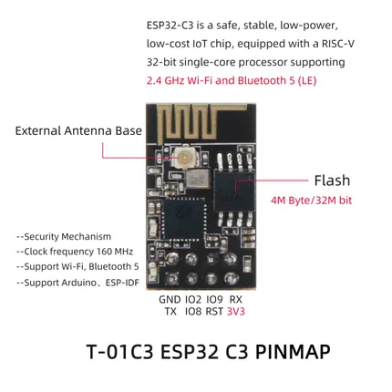
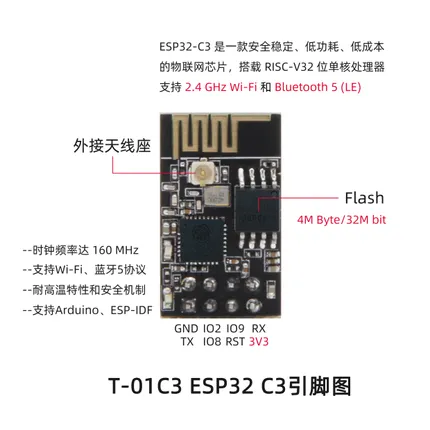

# T-01C3

**LILYGO** · ESP32-C3

Revision: Not identified  
Coverage: Pinout image collected

[Browse all manufacturers](../../../../BROWSE.md) · [Desktop app](https://github.com/valleytechsolutions/black-wire-desktop)

## T-01C3pin

**pinout image** · Reviewed source · JPG

[Open original reference](../../../../library/media/d17d8ff78f8813501e384c6209b05288bbc14d9397869945c50d6ca0a54e9dee.jpg)

**Credit and rights:** Not established; source attribution retained. Source/manufacturer: LILYGO.

[Source 1](https://raw.githubusercontent.com/Xinyuan-LilyGO/T-01C3/e4e6dda5ef07e33936ded354b3abea463857b67d/image/T-01C3pin.jpg) · [Source 2](https://github.com/Xinyuan-LilyGO/T-01C3/blob/e4e6dda5ef07e33936ded354b3abea463857b67d/image/T-01C3pin.jpg)

Original manufacturer diagram. Shown module, radio, display and power-system options must match the board.

SHA-256: `d17d8ff78f8813501e384c6209b05288bbc14d9397869945c50d6ca0a54e9dee`

## T-01C3pin_cn

**pinout image** · Reviewed source · JPG

[Open original reference](../../../../library/media/66b0e5b513e27f4e3c129801bf4c773caf5207f1985acd380e44093bac5f1583.jpg)

**Credit and rights:** Not established; source attribution retained. Source/manufacturer: LILYGO.

[Source 1](https://raw.githubusercontent.com/Xinyuan-LilyGO/T-01C3/e4e6dda5ef07e33936ded354b3abea463857b67d/image/T-01C3pin_cn.jpg) · [Source 2](https://github.com/Xinyuan-LilyGO/T-01C3/blob/e4e6dda5ef07e33936ded354b3abea463857b67d/image/T-01C3pin_cn.jpg)

Original manufacturer diagram. Shown module, radio, display and power-system options must match the board.

SHA-256: `66b0e5b513e27f4e3c129801bf4c773caf5207f1985acd380e44093bac5f1583`

Pin assignments have not been independently electrically verified. Check board revision before wiring.
