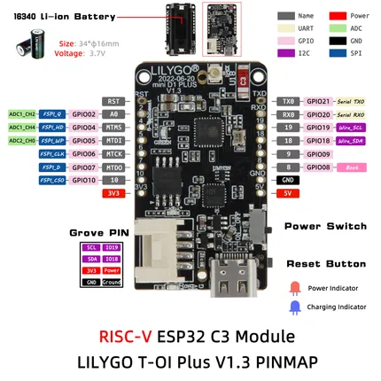

# T-OI-Plus V1.3

**LILYGO** · ESP32-C3

Revision: Not identified  
Coverage: Pinout image collected

[Browse all manufacturers](../../../../BROWSE.md) · [Desktop app](https://github.com/valleytechsolutions/black-wire-desktop)

## new_TOI_Plus

**pinout image** · Reviewed source · JPG

[Open original reference](../../../../library/media/fbe2b139a2dfc47260c90c0d35bef6b0d4f27a4badb93c49e01ad921e2152cb7.jpg)

**Credit and rights:** Not established; source attribution retained. Source/manufacturer: LILYGO.

[Source 1](https://raw.githubusercontent.com/Xinyuan-LilyGO/LilyGo-T-OI-PLUS/2c15f73f635d3629ae70c66e3dfcbd47a2815caa/image/new_TOI_Plus.png) · [Source 2](https://github.com/Xinyuan-LilyGO/LilyGo-T-OI-PLUS/blob/2c15f73f635d3629ae70c66e3dfcbd47a2815caa/image/new_TOI_Plus.png)

Original manufacturer diagram. Shown module, radio, display and power-system options must match the board.

SHA-256: `fbe2b139a2dfc47260c90c0d35bef6b0d4f27a4badb93c49e01ad921e2152cb7`

Pin assignments have not been independently electrically verified. Check board revision before wiring.
