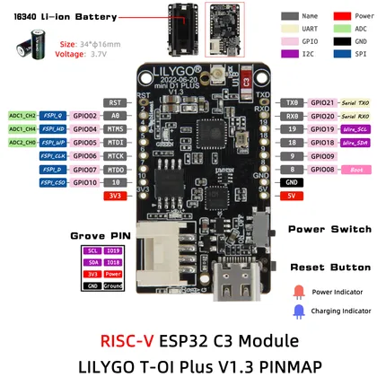

# T-OI-Plus V1.3

**LILYGO** · ESP32-C3

Revision: Not identified

Coverage: Pinout image collected

[Browse all manufacturers](../../../../BROWSE.md) · [Devices & IoT](../../../../DEVICES.md) · [Open in the browser guide](https://valleytech-black-wire-guide.pages.dev/?board=lilygo-esp32-t-oi-plus-v1-3)

## Datasheets and original documentation

Board datasheet: **not yet recorded**. Visual reference: **available**.

Original manufacturer website still needs identification.

A chip datasheet, schematic and board datasheet have different scopes. Match the exact hardware revision.

[Documentation coverage and remaining gaps](../../../../DOCUMENTATION.md)

## new_TOI_Plus

**pinout image** · Reviewed source · JPG

[Open original reference](../../../../library/media/fbe2b139a2dfc47260c90c0d35bef6b0d4f27a4badb93c49e01ad921e2152cb7.jpg)

**Credit and rights:** Not established; source attribution retained. Source/manufacturer: LILYGO.

[Source 1](https://raw.githubusercontent.com/Xinyuan-LilyGO/LilyGo-T-OI-PLUS/2c15f73f635d3629ae70c66e3dfcbd47a2815caa/image/new_TOI_Plus.png) · [Source 2](https://github.com/Xinyuan-LilyGO/LilyGo-T-OI-PLUS/blob/2c15f73f635d3629ae70c66e3dfcbd47a2815caa/image/new_TOI_Plus.png)

Original manufacturer diagram. Shown module, radio, display and power-system options must match the board.

Image revision: Not identified

SHA-256: `fbe2b139a2dfc47260c90c0d35bef6b0d4f27a4badb93c49e01ad921e2152cb7`

Pin assignments have not been independently electrically verified. Check board revision before wiring.
