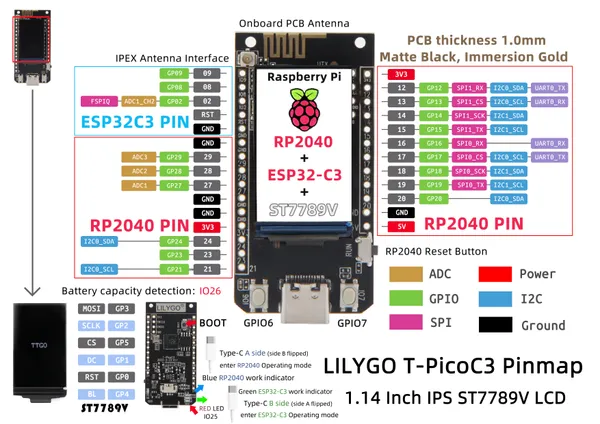

# T-PicoC3

**LILYGO** · ESP32-C3

Revision: Not identified  
Coverage: Pinout image collected

[Browse all manufacturers](../../../../BROWSE.md) · [Desktop app](https://github.com/valleytechsolutions/black-wire-desktop)

## T-PicoC3_en

**pinout image** · Reviewed source · JPG

[Open original reference](../../../../library/media/22890f78e62979c34ef9c55dda8a8a712cb2cb6331caca83697ad0cecb1c80a1.jpg)

**Credit and rights:** Not established; source attribution retained. Source/manufacturer: LILYGO.

[Source 1](https://raw.githubusercontent.com/Xinyuan-LilyGO/T-PicoC3/9565b8a0e10f5def2d0c34015f9e3328f846a751/image/T-PicoC3_en.jpg) · [Source 2](https://github.com/Xinyuan-LilyGO/T-PicoC3/blob/9565b8a0e10f5def2d0c34015f9e3328f846a751/image/T-PicoC3_en.jpg)

Original manufacturer diagram. Shown module, radio, display and power-system options must match the board.

SHA-256: `22890f78e62979c34ef9c55dda8a8a712cb2cb6331caca83697ad0cecb1c80a1`

Pin assignments have not been independently electrically verified. Check board revision before wiring.
