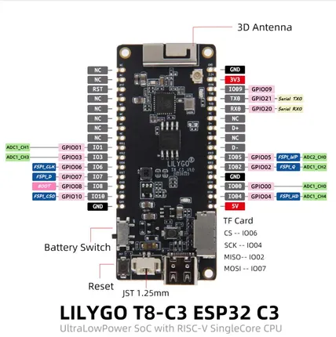

# T8-C3

**LILYGO** · ESP32-C3

Revision: Not identified  
Coverage: Pinout image collected

[Browse all manufacturers](../../../../BROWSE.md) · [Desktop app](https://github.com/valleytechsolutions/black-wire-desktop)

## T8-C3

**pinout image** · Reviewed source · JPG

[Open original reference](../../../../library/media/f4b35576d02f641386f5472390f00dd04ec305770c950bc2935b1d5eff787eb7.jpg)

**Credit and rights:** Not established; source attribution retained. Source/manufacturer: LILYGO.

[Source 1](https://raw.githubusercontent.com/Xinyuan-LilyGO/T8-C3/9673426fc2862fc330c71421077035d0d496a124/image/T8-C3.jpg) · [Source 2](https://github.com/Xinyuan-LilyGO/T8-C3/blob/9673426fc2862fc330c71421077035d0d496a124/image/T8-C3.jpg)

SHA-256: `f4b35576d02f641386f5472390f00dd04ec305770c950bc2935b1d5eff787eb7`

Pin assignments have not been independently electrically verified. Check board revision before wiring.
