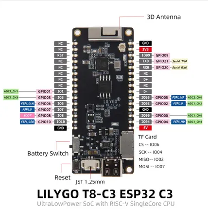

# T8-C3

**LILYGO** · ESP32-C3

Revision: Not identified

Coverage: Pinout image collected

[Browse all manufacturers](../../../../BROWSE.md) · [Devices & IoT](../../../../DEVICES.md) · [Open in the browser guide](https://valleytech-black-wire-guide.pages.dev/?board=lilygo-esp32-t8-c3)

## Datasheets and original documentation

Board datasheet: **not yet recorded**. Visual reference: **available**.

Original manufacturer website still needs identification.

A chip datasheet, schematic and board datasheet have different scopes. Match the exact hardware revision.

[Documentation coverage and remaining gaps](../../../../DOCUMENTATION.md)

## T8-C3

**pinout image** · Reviewed source · JPG

[Open original reference](../../../../library/media/f4b35576d02f641386f5472390f00dd04ec305770c950bc2935b1d5eff787eb7.jpg)

**Credit and rights:** Not established; source attribution retained. Source/manufacturer: LILYGO.

[Source 1](https://raw.githubusercontent.com/Xinyuan-LilyGO/T8-C3/9673426fc2862fc330c71421077035d0d496a124/image/T8-C3.jpg) · [Source 2](https://github.com/Xinyuan-LilyGO/T8-C3/blob/9673426fc2862fc330c71421077035d0d496a124/image/T8-C3.jpg)

Image revision: Not identified

SHA-256: `f4b35576d02f641386f5472390f00dd04ec305770c950bc2935b1d5eff787eb7`

Pin assignments have not been independently electrically verified. Check board revision before wiring.
