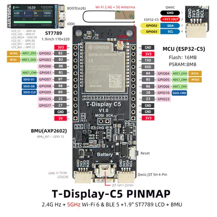

# T-Display C5

**LILYGO** · ESP32-C5

Revision: Not identified  
Coverage: Pinout image collected

[Browse all manufacturers](../../../../BROWSE.md) · [Devices & IoT](../../../../DEVICES.md) · [Open in the browser guide](https://valleytech-black-wire-guide.pages.dev/?board=lilygo-esp32-t-display-c5)

Device category: **Displays & HMI**

## Board pin map

**pinout image** · Reviewed source · JPG

[Open original reference](../../../../library/media/b9385344f035f033105c83125322f501515de37c8e9427e861281c669382ad10.jpg)

**Credit and rights:** Not established; source attribution retained. Source/manufacturer: LILYGO.

[Source 1](https://wiki.lilygo.cc/products/t-display-series/t-display-c5/index/image/t-display-c5-pinout.jpg) · [Source 2](https://wiki.lilygo.cc/products/t-display-series/t-display-c5/)

Manufacturer image preserved. Match the depicted board and revision before use.

Image revision: Not identified

SHA-256: `b9385344f035f033105c83125322f501515de37c8e9427e861281c669382ad10`

Pin assignments have not been independently electrically verified. Check board revision before wiring.
