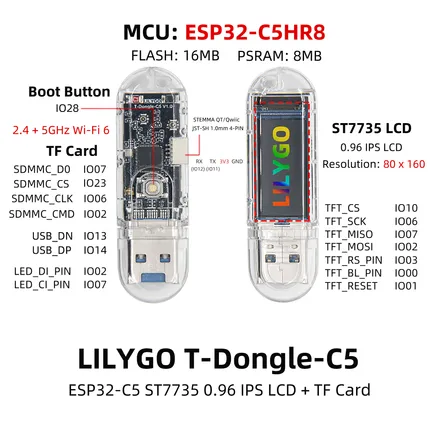

# T-Dongle-C5

**LILYGO** · ESP32-C5

Revision: Not identified  
Coverage: Pinout image collected

[Browse all manufacturers](../../../../BROWSE.md) · [Desktop app](https://github.com/valleytechsolutions/black-wire-desktop)

## Board pin map

**pinout image** · Reviewed source · JPG

[Open original reference](../../../../library/media/2560633a0912425aa09584195e63bc560fe5d78ec68fbd158f3fe22cacd77644.jpg)

**Credit and rights:** Not established; source attribution retained. Source/manufacturer: LILYGO.

[Source 1](https://wiki.lilygo.cc/products/t-dongle-series/t-dongle-c5/index/image/t-dongle-c5-pinout.jpg) · [Source 2](https://wiki.lilygo.cc/products/t-dongle-series/t-dongle-c5/)

Manufacturer image preserved. Match the depicted board and revision before use.

SHA-256: `2560633a0912425aa09584195e63bc560fe5d78ec68fbd158f3fe22cacd77644`

Pin assignments have not been independently electrically verified. Check board revision before wiring.
