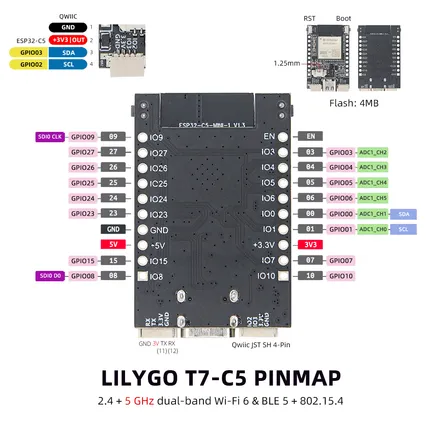

# T7-C5

**LILYGO** · ESP32-C5

Revision: Not identified  
Coverage: Pinout image collected

[Browse all manufacturers](../../../../BROWSE.md) · [Desktop app](https://github.com/valleytechsolutions/black-wire-desktop)

## Board pin map

**pinout image** · Reviewed source · JPG

[Open original reference](../../../../library/media/fa8f9ef0410969fde72d23b33b1a73deab8996f0f844a3d8e61f5d02473bb10d.jpg)

**Credit and rights:** Not established; source attribution retained. Source/manufacturer: LILYGO.

[Source 1](https://wiki.lilygo.cc/products/t7-series/t7-c5/index/image/t7-c5-pinout.jpg) · [Source 2](https://wiki.lilygo.cc/products/t7-series/t7-c5/)

Manufacturer image preserved. Match the depicted board and revision before use.

SHA-256: `fa8f9ef0410969fde72d23b33b1a73deab8996f0f844a3d8e61f5d02473bb10d`

Pin assignments have not been independently electrically verified. Check board revision before wiring.
