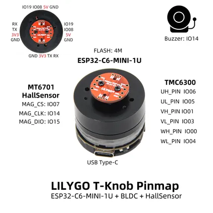

# T-Knob

**LILYGO** · ESP32-C6

Revision: Not identified  
Coverage: Pinout image collected

[Browse all manufacturers](../../../../BROWSE.md) · [Desktop app](https://github.com/valleytechsolutions/black-wire-desktop)

## Board pin map

**pinout image** · Reviewed source · JPG

[Open original reference](../../../../library/media/34f76644d84407aeebaa86b69cbff664c36ca38944524f403ddca0e1ec645086.jpg)

**Credit and rights:** Not established; source attribution retained. Source/manufacturer: LILYGO.

[Source 1](https://wiki.lilygo.cc/products/other/t-knob/index/image/t-knob-pin-en.jpg) · [Source 2](https://wiki.lilygo.cc/products/other/t-knob/)

Manufacturer image preserved. Match the depicted board and revision before use.

SHA-256: `34f76644d84407aeebaa86b69cbff664c36ca38944524f403ddca0e1ec645086`

Pin assignments have not been independently electrically verified. Check board revision before wiring.
