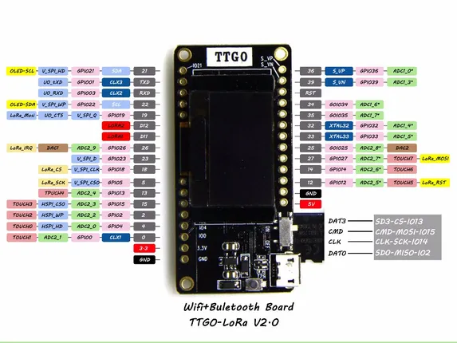

# LoRa32 V2.0

**LILYGO** · ESP32 original

Revision: V2.0 printed on diagram  
Coverage: Pinout image collected

[Browse all manufacturers](../../../../BROWSE.md) · [Devices & IoT](../../../../DEVICES.md) · [Open in the browser guide](https://valleytech-black-wire-guide.pages.dev/?board=lilygo-esp32-lora32-v2-0)

Device category: **Radios & GNSS**

## lora32_v2.0_pinmap

**pinout image** · Reviewed source · JPG

[Open original reference](../../../../library/media/6bb93eb9f674d8955e73712b4d3ecc4e7ce799183eec7e70714f0d3c7bb98f50.jpg)

**Credit and rights:** Not established; source attribution retained. Source/manufacturer: LILYGO.

[Source 1](https://raw.githubusercontent.com/Xinyuan-LilyGO/LilyGo-LoRa-Series/5e2da3f519a25e91b9b14c3071e36a568bbd949d/assets/image/lora32_v2.0_pinmap.jpg) · [Source 2](https://github.com/Xinyuan-LilyGO/LilyGo-LoRa-Series/blob/5e2da3f519a25e91b9b14c3071e36a568bbd949d/assets/image/lora32_v2.0_pinmap.jpg)

V2.0 printed on diagram

Image revision: V2.0 printed on diagram

SHA-256: `6bb93eb9f674d8955e73712b4d3ecc4e7ce799183eec7e70714f0d3c7bb98f50`

Pin assignments have not been independently electrically verified. Check board revision before wiring.
