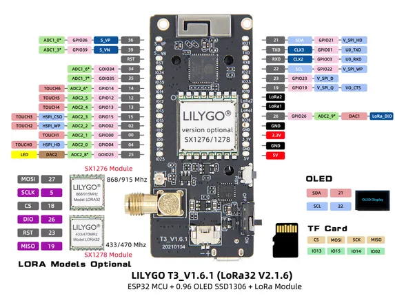
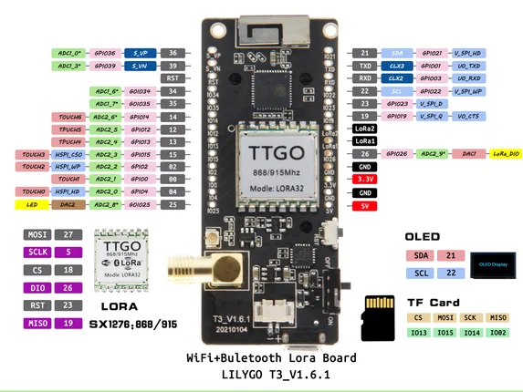

# LoRa32 V2.1.6 (T3 V1.6.1)

**LILYGO** · ESP32 original

Revision: Multiple source/revision records; see individual assets  
Coverage: Pinout image collected

[Browse all manufacturers](../../../../BROWSE.md) · [Desktop app](https://github.com/valleytechsolutions/black-wire-desktop)

## Board pin map

**pinout image** · Reviewed source · JPG

[Open original reference](../../../../library/media/5a3a51b65b0cb2f83618e5ace6fcc56c079431963df2007c32f58fed8ba87985.jpg)

**Credit and rights:** Not established; source attribution retained. Source/manufacturer: LILYGO.

[Source 1](https://wiki.lilygo.cc/products/t3-series/t3-lora32/index/image/lora32-pin.jpg) · [Source 2](https://wiki.lilygo.cc/products/t3-series/t3-lora32/)

Manufacturer image preserved. Match the depicted board and revision before use. Source page name: LoRa32. Saved model name follows the printed diagram.

SHA-256: `5a3a51b65b0cb2f83618e5ace6fcc56c079431963df2007c32f58fed8ba87985`

## lora32_v1.6.1_pinmap

**pinout image** · Reviewed source · JPG

[Open original reference](../../../../library/media/982cdb0b8056960cce23d32d7210f2595da095d69b5b86a702324f8f975a662e.jpg)

**Credit and rights:** Not established; source attribution retained. Source/manufacturer: LILYGO.

[Source 1](https://raw.githubusercontent.com/Xinyuan-LilyGO/LilyGo-LoRa-Series/5e2da3f519a25e91b9b14c3071e36a568bbd949d/assets/image/lora32_v1.6.1_pinmap.jpg) · [Source 2](https://github.com/Xinyuan-LilyGO/LilyGo-LoRa-Series/blob/5e2da3f519a25e91b9b14c3071e36a568bbd949d/assets/image/lora32_v1.6.1_pinmap.jpg)

T3 V1.6.1 printed on diagram

SHA-256: `982cdb0b8056960cce23d32d7210f2595da095d69b5b86a702324f8f975a662e`

Pin assignments have not been independently electrically verified. Check board revision before wiring.
