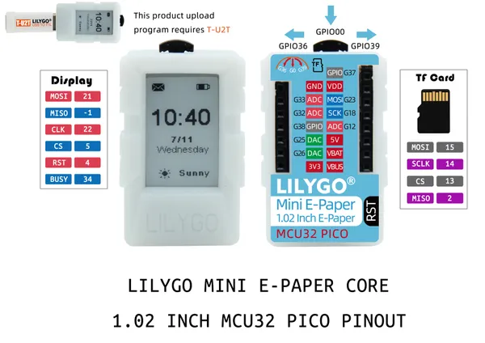

# Mini E-Paper 1.02 Core

**LILYGO** · ESP32 original

Revision: Not identified  
Coverage: Pinout image collected

[Browse all manufacturers](../../../../BROWSE.md) · [Desktop app](https://github.com/valleytechsolutions/black-wire-desktop)

## MINI1.02CORE

**pinout image** · Reviewed source · JPG

[Open original reference](../../../../library/media/680022af2373ceace678eb76a7fcee47718d12eed57e69a3787b21fa3ea0e152.jpg)

**Credit and rights:** Not established; source attribution retained. Source/manufacturer: LILYGO.

[Source 1](https://raw.githubusercontent.com/Xinyuan-LilyGO/LilyGO-Mini-Epaper/73441be24a207b9789e49c5781b137550eef1f56/images/MINI1.02CORE.jpg) · [Source 2](https://github.com/Xinyuan-LilyGO/LilyGO-Mini-Epaper/blob/73441be24a207b9789e49c5781b137550eef1f56/images/MINI1.02CORE.jpg)

Original manufacturer diagram. Shown module, radio, display and power-system options must match the board.

SHA-256: `680022af2373ceace678eb76a7fcee47718d12eed57e69a3787b21fa3ea0e152`

Pin assignments have not been independently electrically verified. Check board revision before wiring.
