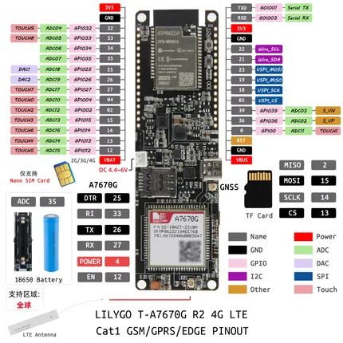

# T-A7670G R2

**LILYGO** · ESP32 original

Revision: Not identified  
Coverage: Pinout image collected

[Browse all manufacturers](../../../../BROWSE.md) · [Desktop app](https://github.com/valleytechsolutions/black-wire-desktop)

## Board pin map

**pinout image** · Reviewed source · JPG

[Open original reference](../../../../library/media/9937a588632b2523769dd521c5cb086b48be23a544656cf5f7dec70586fd0610.jpg)

**Credit and rights:** Not established; source attribution retained. Source/manufacturer: LILYGO.

[Source 1](https://wiki.lilygo.cc/products/t-sim-series/t-a7670/index/image/t-a7670g-zh.jpg) · [Source 2](https://wiki.lilygo.cc/products/t-sim-series/t-a7670/)

Manufacturer image preserved. Match the depicted board and revision before use. Source page name: T-A7670X. Saved model name follows the printed diagram.

SHA-256: `9937a588632b2523769dd521c5cb086b48be23a544656cf5f7dec70586fd0610`

Pin assignments have not been independently electrically verified. Check board revision before wiring.
