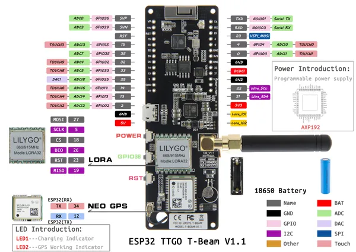

# T-Beam

**LILYGO** · ESP32 original

Revision: Not identified  
Coverage: Pinout image collected

[Browse all manufacturers](../../../../BROWSE.md) · [Devices & IoT](../../../../DEVICES.md) · [Open in the browser guide](https://valleytech-black-wire-guide.pages.dev/?board=lilygo-esp32-t-beam)

Device category: **Radios & GNSS**

## Board pin map

**pinout image** · Reviewed source · JPG

[Open original reference](../../../../library/media/9559bc8c3e5db9376855b9dca719894005954c19fb7b7027b21061d8dfc36d46.jpg)

**Credit and rights:** Not established; source attribution retained. Source/manufacturer: LILYGO.

[Source 1](https://wiki.lilygo.cc/products/t-beam-series/t-beam/index/image/t-beam-pinout.jpg) · [Source 2](https://wiki.lilygo.cc/products/t-beam-series/t-beam/)

Manufacturer image preserved. Match the depicted board and revision before use.

Image revision: Not identified

SHA-256: `9559bc8c3e5db9376855b9dca719894005954c19fb7b7027b21061d8dfc36d46`

Pin assignments have not been independently electrically verified. Check board revision before wiring.
