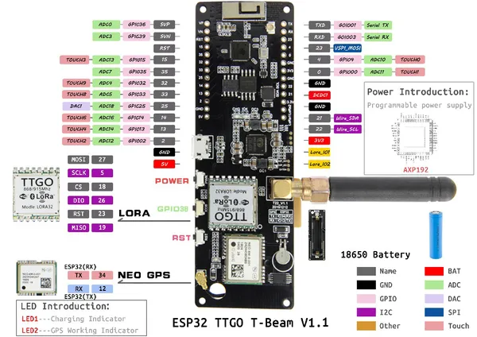

# T-Beam V1.1

**LILYGO** · ESP32 original

Revision: AXP192 power system shown; do not apply automatically to AXP2101 revisions  
Coverage: Pinout image collected

[Browse all manufacturers](../../../../BROWSE.md) · [Devices & IoT](../../../../DEVICES.md) · [Open in the browser guide](https://valleytech-black-wire-guide.pages.dev/?board=lilygo-esp32-t-beam-v1-1)

Device category: **Radios & GNSS**

## t-beam_v1.1_pinmap

**pinout image** · Reviewed source · JPG

[Open original reference](../../../../library/media/c4373b7e0f9d2100d17578aeaff95f70c62d8314fba945afbbf7c82b939b05a6.jpg)

**Credit and rights:** Not established; source attribution retained. Source/manufacturer: LILYGO.

[Source 1](https://raw.githubusercontent.com/Xinyuan-LilyGO/LilyGo-LoRa-Series/5e2da3f519a25e91b9b14c3071e36a568bbd949d/assets/image/t-beam_v1.1_pinmap.jpg) · [Source 2](https://github.com/Xinyuan-LilyGO/LilyGo-LoRa-Series/blob/5e2da3f519a25e91b9b14c3071e36a568bbd949d/assets/image/t-beam_v1.1_pinmap.jpg)

AXP192 power system shown; do not apply automatically to AXP2101 revisions

Image revision: AXP192 power system shown; do not apply automatically to AXP2101 revisions

SHA-256: `c4373b7e0f9d2100d17578aeaff95f70c62d8314fba945afbbf7c82b939b05a6`

Pin assignments have not been independently electrically verified. Check board revision before wiring.
