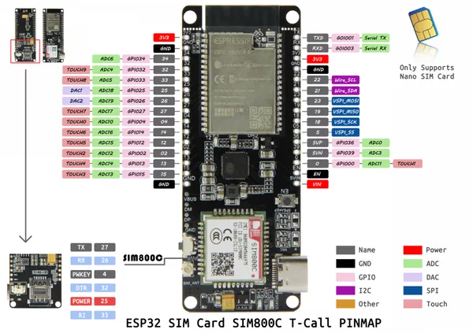

# T-Call SIM800C

**LILYGO** · ESP32 original

Revision: Not identified  
Coverage: Pinout image collected

[Browse all manufacturers](../../../../BROWSE.md) · [Desktop app](https://github.com/valleytechsolutions/black-wire-desktop)

## SIM800C

**pinout image** · Reviewed source · PNG

[Open original reference](../../../../library/media/3cd82ae481df24137d4a359b1148b57147fd55f14e6cbab997e6a533269ec24f.png)

**Credit and rights:** Not established; source attribution retained. Source/manufacturer: LILYGO.

[Source 1](https://raw.githubusercontent.com/Xinyuan-LilyGO/LilyGo-T-Call-SIM800/11db8bf5bc38f52a6122fdfdb6b6a821f26808b8/image/SIM800C.png) · [Source 2](https://github.com/Xinyuan-LilyGO/LilyGo-T-Call-SIM800/blob/11db8bf5bc38f52a6122fdfdb6b6a821f26808b8/image/SIM800C.png)

Original manufacturer diagram. Shown module, radio, display and power-system options must match the board.

SHA-256: `3cd82ae481df24137d4a359b1148b57147fd55f14e6cbab997e6a533269ec24f`

Pin assignments have not been independently electrically verified. Check board revision before wiring.
