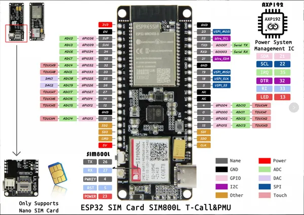

# T-Call SIM800L AXP192

**LILYGO** · ESP32 original

Revision: Not identified  
Coverage: Pinout image collected

[Browse all manufacturers](../../../../BROWSE.md) · [Devices & IoT](../../../../DEVICES.md) · [Open in the browser guide](https://valleytech-black-wire-guide.pages.dev/?board=lilygo-esp32-t-call-sim800l-axp192)

Device category: **Controllers & instruments**

## SIM800L_AXP192

**pinout image** · Reviewed source · JPG

[Open original reference](../../../../library/media/395c2f769df18220caefae3d9cf7f0abbcf488fe6c52deef9b940c88c3104fa9.jpg)

**Credit and rights:** Not established; source attribution retained. Source/manufacturer: LILYGO.

[Source 1](https://raw.githubusercontent.com/Xinyuan-LilyGO/LilyGo-T-Call-SIM800/11db8bf5bc38f52a6122fdfdb6b6a821f26808b8/image/SIM800L_AXP192.jpg) · [Source 2](https://github.com/Xinyuan-LilyGO/LilyGo-T-Call-SIM800/blob/11db8bf5bc38f52a6122fdfdb6b6a821f26808b8/image/SIM800L_AXP192.jpg)

Original manufacturer diagram. Shown module, radio, display and power-system options must match the board.

Image revision: Not identified

SHA-256: `395c2f769df18220caefae3d9cf7f0abbcf488fe6c52deef9b940c88c3104fa9`

Pin assignments have not been independently electrically verified. Check board revision before wiring.
