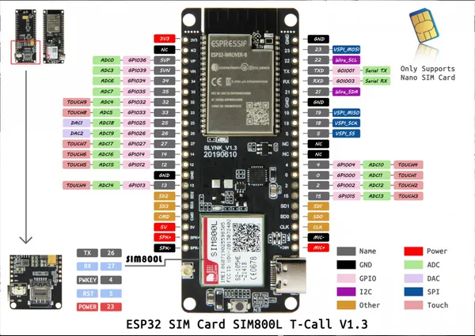

# T-Call SIM800L V1.3

**LILYGO** · ESP32 original

Revision: Not identified  
Coverage: Pinout image collected

[Browse all manufacturers](../../../../BROWSE.md) · [Desktop app](https://github.com/valleytechsolutions/black-wire-desktop)

## T-Call

**pinout image** · Reviewed source · JPG

[Open original reference](../../../../library/media/d61afe3acc76434e6963a13c324b8af712d9dc09191ebb152b3413fbd8275cb6.jpg)

**Credit and rights:** Not established; source attribution retained. Source/manufacturer: LILYGO.

[Source 1](https://raw.githubusercontent.com/Xinyuan-LilyGO/LilyGo-T-Call-SIM800/11db8bf5bc38f52a6122fdfdb6b6a821f26808b8/image/T-Call.jpg) · [Source 2](https://github.com/Xinyuan-LilyGO/LilyGo-T-Call-SIM800/blob/11db8bf5bc38f52a6122fdfdb6b6a821f26808b8/image/T-Call.jpg)

Original manufacturer diagram. Shown module, radio, display and power-system options must match the board.

SHA-256: `d61afe3acc76434e6963a13c324b8af712d9dc09191ebb152b3413fbd8275cb6`

## SIM800L_IP5306

**pinout image** · Reviewed source · JPG

[Open original reference](../../../../library/media/7c8897473bdeb062aa7bf0e4e747a3218c2c8c311e36c952f7f288dc378d996d.jpg)

**Credit and rights:** Not established; source attribution retained. Source/manufacturer: LILYGO.

[Source 1](https://raw.githubusercontent.com/Xinyuan-LilyGO/LilyGo-T-Call-SIM800/11db8bf5bc38f52a6122fdfdb6b6a821f26808b8/image/SIM800L_IP5306.jpg) · [Source 2](https://github.com/Xinyuan-LilyGO/LilyGo-T-Call-SIM800/blob/11db8bf5bc38f52a6122fdfdb6b6a821f26808b8/image/SIM800L_IP5306.jpg)

Original manufacturer diagram. Shown module, radio, display and power-system options must match the board.

SHA-256: `7c8897473bdeb062aa7bf0e4e747a3218c2c8c311e36c952f7f288dc378d996d`

Pin assignments have not been independently electrically verified. Check board revision before wiring.
