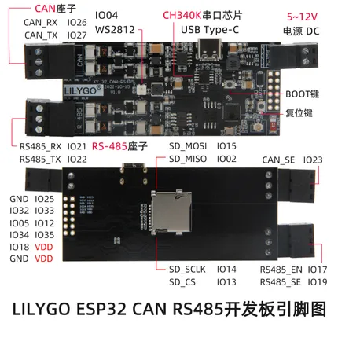
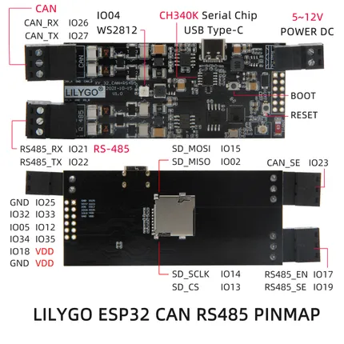

# T-CAN485 (CH340K)

**LILYGO** · ESP32 original

Revision: Multiple source/revision records; see individual assets  
Coverage: Pinout image collected

[Browse all manufacturers](../../../../BROWSE.md) · [Devices & IoT](../../../../DEVICES.md) · [Open in the browser guide](https://valleytech-black-wire-guide.pages.dev/?board=lilygo-esp32-t-can485-ch340k)

Device category: **Controllers & instruments**

## T-CAN485-PINMAP-CN

**pinout image** · Reviewed source · JPG

[Open original reference](../../../../library/media/5c7dd82b43eccf90ea07af9032c2ae620c1643c5103b983f211d03293b024417.jpg)

**Credit and rights:** Not established; source attribution retained. Source/manufacturer: LILYGO.

[Source 1](https://raw.githubusercontent.com/Xinyuan-LilyGO/T-CAN485/e6f92dab557b938226741d989124acebbe4fbf94/image/T-CAN485-PINMAP-CN.jpg) · [Source 2](https://github.com/Xinyuan-LilyGO/T-CAN485/blob/e6f92dab557b938226741d989124acebbe4fbf94/image/T-CAN485-PINMAP-CN.jpg)

Chinese labels; CH340K version

Image revision: Chinese labels; CH340K version

SHA-256: `5c7dd82b43eccf90ea07af9032c2ae620c1643c5103b983f211d03293b024417`

## T-CAN485-PINMAP-EN

**pinout image** · Reviewed source · JPG

[Open original reference](../../../../library/media/1b04f43c0058ec3050bb16a4fede8305b744f55ecf6aaeffe2a12cb6d7e909ed.jpg)

**Credit and rights:** Not established; source attribution retained. Source/manufacturer: LILYGO.

[Source 1](https://raw.githubusercontent.com/Xinyuan-LilyGO/T-CAN485/e6f92dab557b938226741d989124acebbe4fbf94/image/T-CAN485-PINMAP-EN.jpg) · [Source 2](https://github.com/Xinyuan-LilyGO/T-CAN485/blob/e6f92dab557b938226741d989124acebbe4fbf94/image/T-CAN485-PINMAP-EN.jpg)

English labels; CH340K version

Image revision: English labels; CH340K version

SHA-256: `1b04f43c0058ec3050bb16a4fede8305b744f55ecf6aaeffe2a12cb6d7e909ed`

Pin assignments have not been independently electrically verified. Check board revision before wiring.
