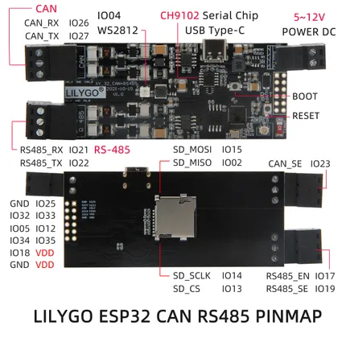

# T-CAN485 (CH9102)

**LILYGO** · ESP32 original

Revision: CH9102 version with different RS485 pin assignment  
Coverage: Pinout image collected

[Browse all manufacturers](../../../../BROWSE.md) · [Devices & IoT](../../../../DEVICES.md) · [Open in the browser guide](https://valleytech-black-wire-guide.pages.dev/?board=lilygo-esp32-t-can485-ch9102)

Device category: **Controllers & instruments**

## T-CAN485-PINMAP1-EN

**pinout image** · Reviewed source · JPG

[Open original reference](../../../../library/media/c9527c3a79ba0898be7f88ec854868cd7b83919c360166e7f4dfe02f31b6a73f.jpg)

**Credit and rights:** Not established; source attribution retained. Source/manufacturer: LILYGO.

[Source 1](https://raw.githubusercontent.com/Xinyuan-LilyGO/T-CAN485/e6f92dab557b938226741d989124acebbe4fbf94/image/T-CAN485-PINMAP1-EN.jpg) · [Source 2](https://github.com/Xinyuan-LilyGO/T-CAN485/blob/e6f92dab557b938226741d989124acebbe4fbf94/image/T-CAN485-PINMAP1-EN.jpg)

CH9102 version with different RS485 pin assignment

Image revision: CH9102 version with different RS485 pin assignment

SHA-256: `c9527c3a79ba0898be7f88ec854868cd7b83919c360166e7f4dfe02f31b6a73f`

Pin assignments have not been independently electrically verified. Check board revision before wiring.
