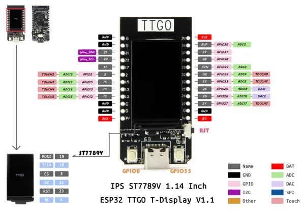

# T-Display

**LILYGO** · ESP32 original

Revision: Not identified  
Coverage: Pinout image collected

[Browse all manufacturers](../../../../BROWSE.md) · [Desktop app](https://github.com/valleytechsolutions/black-wire-desktop)

## Board pin map

**pinout image** · Reviewed source · JPG

[Open original reference](../../../../library/media/fdea840f194a9a6c98bd39c25070b37c0c541a522f6b5f20a5eb6dd86336a142.jpg)

**Credit and rights:** Not established; source attribution retained. Source/manufacturer: LILYGO.

[Source 1](https://wiki.lilygo.cc/products/t-display-series/t-display/index/image/t-display-pinout.jpg) · [Source 2](https://wiki.lilygo.cc/products/t-display-series/t-display/)

Manufacturer image preserved. Match the depicted board and revision before use.

SHA-256: `fdea840f194a9a6c98bd39c25070b37c0c541a522f6b5f20a5eb6dd86336a142`

Pin assignments have not been independently electrically verified. Check board revision before wiring.
