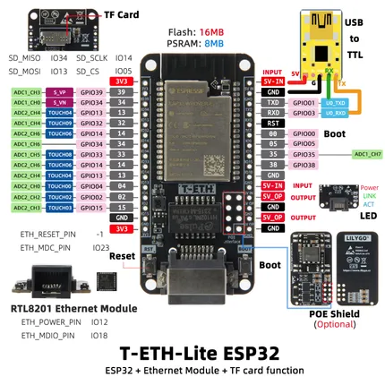

# T-ETH Lite

**LILYGO** · ESP32 original

Revision: Not identified  
Coverage: Pinout image collected

[Browse all manufacturers](../../../../BROWSE.md) · [Devices & IoT](../../../../DEVICES.md) · [Open in the browser guide](https://valleytech-black-wire-guide.pages.dev/?board=lilygo-esp32-t-eth-lite)

Device category: **Controllers & instruments**

## Board pin map

**pinout image** · Reviewed source · JPG

[Open original reference](../../../../library/media/c4d7cffa47e9b750f6b520c7c26e18e18c80477e7bb1f7fbebc5f100bc768759.jpg)

**Credit and rights:** Not established; source attribution retained. Source/manufacturer: LILYGO.

[Source 1](https://wiki.lilygo.cc/products/t-eth-series/t-eth-lite/index/image/t-eth-lite-pin-en.jpg) · [Source 2](https://wiki.lilygo.cc/products/t-eth-series/t-eth-lite/)

Manufacturer image preserved. Match the depicted board and revision before use.

Image revision: Not identified

SHA-256: `c4d7cffa47e9b750f6b520c7c26e18e18c80477e7bb1f7fbebc5f100bc768759`

Pin assignments have not been independently electrically verified. Check board revision before wiring.
