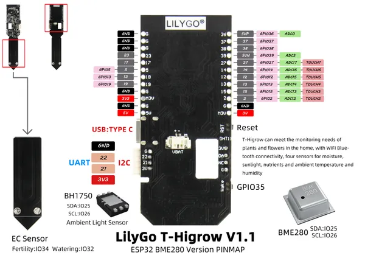

# T-HiGrow V1.1 BME280

**LILYGO** · ESP32 original

Revision: Not identified  
Coverage: Pinout image collected

[Browse all manufacturers](../../../../BROWSE.md) · [Devices & IoT](../../../../DEVICES.md) · [Open in the browser guide](https://valleytech-black-wire-guide.pages.dev/?board=lilygo-esp32-t-higrow-v1-1-bme280)

Device category: **Controllers & instruments**

## img1

**pinout image** · Reviewed source · JPG

[Open original reference](../../../../library/media/1a3a852ab95dcc71a77500f41ea81cd55b8c8a0322ab67030939dec51a4e1b2f.jpg)

**Credit and rights:** Not established; source attribution retained. Source/manufacturer: LILYGO.

[Source 1](https://raw.githubusercontent.com/Xinyuan-LilyGO/LilyGo-HiGrow/f5732ce6012e6ece349c9d1788bad4cf392c9aca/image/img1.jpg) · [Source 2](https://github.com/Xinyuan-LilyGO/LilyGo-HiGrow/blob/f5732ce6012e6ece349c9d1788bad4cf392c9aca/image/img1.jpg)

Original manufacturer diagram. Shown module, radio, display and power-system options must match the board.

Image revision: Not identified

SHA-256: `1a3a852ab95dcc71a77500f41ea81cd55b8c8a0322ab67030939dec51a4e1b2f`

Pin assignments have not been independently electrically verified. Check board revision before wiring.
