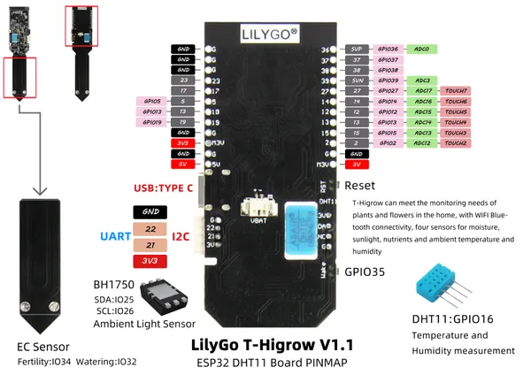

# T-HiGrow V1.1 DHT11

**LILYGO** · ESP32 original

Revision: Not identified  
Coverage: Pinout image collected

[Browse all manufacturers](../../../../BROWSE.md) · [Devices & IoT](../../../../DEVICES.md) · [Open in the browser guide](https://valleytech-black-wire-guide.pages.dev/?board=lilygo-esp32-t-higrow-v1-1-dht11)

Device category: **Controllers & instruments**

## img2

**pinout image** · Reviewed source · JPG

[Open original reference](../../../../library/media/2d76263001fc5f17a9ebd7ab057067b96e804c081530eb9c813ac61ed973d419.jpg)

**Credit and rights:** Not established; source attribution retained. Source/manufacturer: LILYGO.

[Source 1](https://raw.githubusercontent.com/Xinyuan-LilyGO/LilyGo-HiGrow/f5732ce6012e6ece349c9d1788bad4cf392c9aca/image/img2.jpg) · [Source 2](https://github.com/Xinyuan-LilyGO/LilyGo-HiGrow/blob/f5732ce6012e6ece349c9d1788bad4cf392c9aca/image/img2.jpg)

Original manufacturer diagram. Shown module, radio, display and power-system options must match the board.

Image revision: Not identified

SHA-256: `2d76263001fc5f17a9ebd7ab057067b96e804c081530eb9c813ac61ed973d419`

Pin assignments have not been independently electrically verified. Check board revision before wiring.
