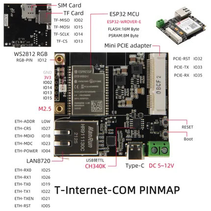

# T-Internet-COM

**LILYGO** · ESP32 original

Revision: Not identified  
Coverage: Pinout image collected

[Browse all manufacturers](../../../../BROWSE.md) · [Desktop app](https://github.com/valleytechsolutions/black-wire-desktop)

## T-Internet-COM

**pinout image** · Reviewed source · JPG

[Open original reference](../../../../library/media/3c040f73c0d28f23275c759a8968b2b83baa1ec36992fcead3d9240340cf7419.jpg)

**Credit and rights:** Not established; source attribution retained. Source/manufacturer: LILYGO.

[Source 1](https://raw.githubusercontent.com/Xinyuan-LilyGO/T-Internet-COM/f53f1c54aac202e83bf326d8a497495d75889412/img/T-Internet-COM.jpg) · [Source 2](https://github.com/Xinyuan-LilyGO/T-Internet-COM/blob/f53f1c54aac202e83bf326d8a497495d75889412/img/T-Internet-COM.jpg)

Original manufacturer diagram. Shown module, radio, display and power-system options must match the board.

SHA-256: `3c040f73c0d28f23275c759a8968b2b83baa1ec36992fcead3d9240340cf7419`

Pin assignments have not been independently electrically verified. Check board revision before wiring.
