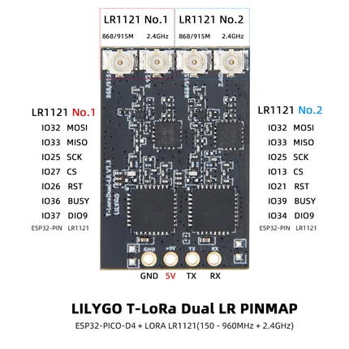

# T-LoRa Dual

**LILYGO** · ESP32 original

Revision: Not identified  
Coverage: Pinout image collected

[Browse all manufacturers](../../../../BROWSE.md) · [Desktop app](https://github.com/valleytechsolutions/black-wire-desktop)

## Board pin map

**pinout image** · Reviewed source · JPG

[Open original reference](../../../../library/media/42df0943165c30fba0e71fd919b5fbe0ed6c7cc8b249619eaf6bb4e233fe00d7.jpg)

**Credit and rights:** Not established; source attribution retained. Source/manufacturer: LILYGO.

[Source 1](https://wiki.lilygo.cc/products/t-lora-series/t-lora-dual/index/image/t-lora-dual-pin.jpg) · [Source 2](https://wiki.lilygo.cc/products/t-lora-series/t-lora-dual/)

Manufacturer image preserved. Match the depicted board and revision before use.

SHA-256: `42df0943165c30fba0e71fd919b5fbe0ed6c7cc8b249619eaf6bb4e233fe00d7`

Pin assignments have not been independently electrically verified. Check board revision before wiring.
