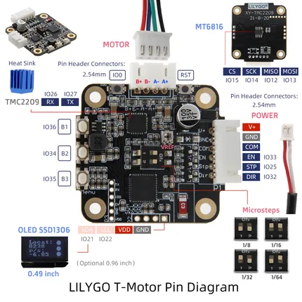

# T-Motor

**LILYGO** · ESP32 original

Revision: Not identified  
Coverage: Pinout image collected

[Browse all manufacturers](../../../../BROWSE.md) · [Devices & IoT](../../../../DEVICES.md) · [Open in the browser guide](https://valleytech-black-wire-guide.pages.dev/?board=lilygo-esp32-t-motor)

Device category: **Controllers & instruments**

## image1

**pinout image** · Reviewed source · JPG

[Open original reference](../../../../library/media/4d8fc007b886d646ee6bd08857e06c3846b222ce578dcf961b3fdb5d983bdf24.jpg)

**Credit and rights:** Not established; source attribution retained. Source/manufacturer: LILYGO.

[Source 1](https://raw.githubusercontent.com/Xinyuan-LilyGO/T-Motor/a867ce9fb0b56c491e3272ae722d607ec00b9259/image/image1.jpg) · [Source 2](https://github.com/Xinyuan-LilyGO/T-Motor/blob/a867ce9fb0b56c491e3272ae722d607ec00b9259/image/image1.jpg)

Original manufacturer diagram. Shown module, radio, display and power-system options must match the board.

Image revision: Not identified

SHA-256: `4d8fc007b886d646ee6bd08857e06c3846b222ce578dcf961b3fdb5d983bdf24`

Pin assignments have not been independently electrically verified. Check board revision before wiring.
